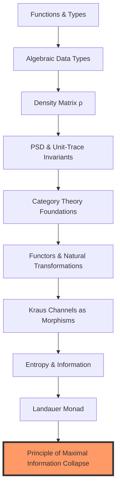

# Quantum-Formal Primer: The Architecture of Verifiable Reality

This document bridges the gap between **Quantum Mechanics** and **Formal Verification**. It is written for physicists, engineers, and philosophers who are familiar with the double-slit experiment but new to machine-checked proofs.

---

## 0. The Critical Thesis
In traditional physics, we use **persuasive arguments**: we write LaTeX, draw diagrams, and hope the peer reviewer doesn't miss a sign error in a 50-step derivation. 

In **Formal Physics**, we use **machine-checked terms**: every step of a proof is verified by a kernel (Lean 4, Coq, Agda) that accepts only logically perfect transitions. If the proof is "well-typed," the conclusion is a mathematical certainty within the given axioms. 

> [!IMPORTANT]
> This isn't just "bug-free code." This is a **conserved truth** where the laws of physics (like Landauer's bound) are encoded as type-level invariants that cannot be violated by construction.

---

## Concept Dependency Map



---

## 1. Functions and Referential Transparency
**Definition.** A function is a pure, reliable mapping that takes one or more inputs and always produces exactly one output according to a fixed rule.

**In this repository.** Every physical simulation (Python/QuTiP) and every proof (Lean 4) relies on pure functions. When we say $V^2 + I^2 \le 1$ is a theorem, we mean there is a pure function `complementarity_check` that returns `True` for every possible input state.

---

## 2. Algebraic Data Types (ADT)
We model physical reality using **Product Types** and **Sum Types**.

### Product Types (The "AND" of Physics)
A `DensityMatrix` is a product of its four complex components $+$ the proofs of its properties.
```lean
structure DensityMatrix where
  data : Matrix (Fin 2) (Fin 2) Complex
  is_hermitian : data = data.conjTranspose
  is_psd       : data.PosSemidef
  is_unit_trace : data.trace = 1
```

### Sum Types (The "OR" of Physics)
A measurement outcome is a sum type: `Either |0⟩ |1⟩`. This forces the code to handle **both** possibilities (slit 0 or slit 1) before the compiler allows progress.

---

## 3. Category Theory: The Language of Composition
Physics is about how systems change. Category theory is the math of **composition**.

- **Objects**: Quantum States ($\rho$).
- **Morphisms**: Physical Processes (Channels $\mathcal{E}$).
- **Composition**: Sequential measurements ($\mathcal{E}_2 \circ \mathcal{E}_1$).

### Functors: Structure Preservation
A **Functor** maps one category to another while preserving the "laws" of composition. In our case, the mapping from **Quantum States** to **Thermodynamic Costs** is a functor: it preserves the ordering and dependencies of measurements.

---

## 4. The Landauer Monad
We think of the "Thermodynamic Cost" as a computational context. Just as a programmer might use a `Writer` monad to log errors, the universe use a "Heat Monad" to log entropy.

> **The Monadic Interaction:**
> When you extract 1 bit of information ($I=1$), the visibility "collapses" ($V=0$). The "Heat Monad" ensures that the dissipated energy $Q \ge k_B T \ln 2$ is tracked and accounted for in the global energy balance.

---

## 5. Critical Section: Persuasion vs. Type-Checking

Traditional papers often use "Assume for simplicity..." or "It follows trivially that...". 

In `UMST-Formal-Double-Slit`, simplicity is earned, not assumed:
- **0 sorry**: Every single lemma is fully expanded into its atomic logical components.
- **Strictly Well-Typed**: The Lean 4 kernel does not understand "intuition." It only understands valid applications of inference rules.
- **5 Explicit Axioms**: We explicitly label the physical "leaps" (e.g., "Landauer's Principle holds for this specific interaction") so they are visible and auditable.

---

## 6. Architecture Layers (Multi-Language Verification)

This repository uses a "Quad-Check" architecture:
1. **Lean 4**: High-level theorem proving and Mathlib integration.
2. **Coq/Rocq**: Extraction to OCaml for high-assurance execution.
3. **Agda**: Dependent type theory exploration and Kleisli category proofs.
4. **Haskell (QuickCheck)**: Property-based testing of the physical limits against billions of random states.

---

## 7. How to Read the Code

| Code Snippet | Physical Meaning | Formal Constraint |
| :--- | :--- | :--- |
| `det(ρ) ≥ 0` | No negative probabilities. | `PosSemidef` invariant. |
| `trace(ρ) = 1` | Conservation of energy/particles. | `UnitTrace` invariant. |
| `V² + I² ≤ 1` | Complementarity Principle. | `ComplementarityTheorem`. |
| `lake build` | The machine verifying reality. | `ProofOfArchitecture`. |

---

## Summary
The **Quantum-Formal Primer** is about moving from "I think this is true" to "The kernel has verified this is true." It turns the double-slit experiment into a computable, verifiable, and thermodynamically consistent object.

---
*Created for Zenodo Release 2026.1 by Studio TYTO.*
