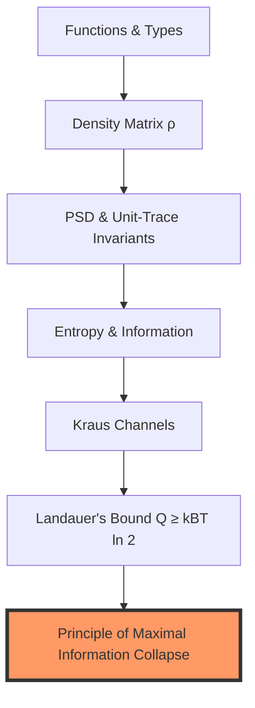

# Quantum-Formal Primer: The Architecture of Verifiable Reality

This document bridges the gap between **Quantum Mechanics** and **Formal Verification**. It is written for physicists, engineers, and philosophers who are familiar with the double-slit experiment but new to machine-checked proofs.

---

## 0. The Critical Thesis
In traditional physics, we use **persuasive arguments**: we write LaTeX, draw diagrams, and hope the peer reviewer doesn't miss a sign error in a 50-step derivation. 

In **Formal Physics**, we use **machine-checked terms**: every step of a proof is verified by a kernel (Lean 4) that accepts only logically perfect transitions. If the proof is "well-typed," the conclusion is a mathematical certainty within the given axioms. 

> [!IMPORTANT]
> This isn't just "bug-free code." This is a **conserved truth** where the laws of physics (like Landauer's bound) are encoded as type-level invariants that cannot be violated by construction.

---

## Concept Dependency Map



---

## 1. The Density Matrix as a Type
In this repository, a quantum state is not just a "box of numbers." It is a **Prop-Gated Type**.

```lean
-- Conceptual Lean 4 structure
structure DensityMatrix where
  data : Matrix (Fin 2) (Fin 2) Complex
  is_hermitian : data = data.conjTranspose
  is_psd       : data.PosSemidef
  is_unit_trace : data.trace = 1
```

**Why this is "Creative":** 
By defining the state this way, any function we write (like the measurement channel) **must** prove that it returns a valid `DensityMatrix`. If a physical transition would break PSD-ness (e.g., negative probabilities), the code **will not compile**.

---

## 2. Measurement as a Monad / Channel
We model the act of "looking" at a slit not as a hand-wavy collapse, but as a **Kleisli Arrow** in the category of quantum states.

- **The Input**: A pure interference state (Off-diagonals ≠ 0).
- **The Process**: A Kraus trace-preserving map (The L\"uders Channel).
- **The Cost**: An increase in diagonal entropy.

### The Landauer Monad
We think of the "Thermodynamic Cost" as a computational side-effect. Just as a programmer might log errors to a console, the universe "logs" decoherence as heat to the environment. 

> **Equation of State:**
> $Q \ge k_B T \ln 2 \cdot (1 - V^2)$
> *Translation:* To destroy visibility $V$, you must pay in Joules $Q$.

---

## 3. Critical Section: Persuasion vs. Type-Checking

Traditional papers often use "Assume for simplicity..." or "It follows trivially that...". 

In `UMST-Formal-Double-Slit`, simplicity is earned, not assumed.
- **0 sorry**: Every single lemma is fully expanded into its atomic logical components.
- **5 Explicit Axioms**: We explicitly label the physical "leaps" (e.g., "Landauer's Principle holds for this specific interaction") so they are visible and auditable, rather than hidden in prose.

---

## 4. How to Read the Code

| If you see... | It represents... |
| :--- | :--- |
| `det(ρ) ≥ 0` | The physical constraint that probabilities cannot be negative. |
| `trace(ρ) = 1` | The law of conservation of probability. |
| `V² + I² ≤ 1` | The fundamental tradeoff between "Which-Path" and "Interference". |
| `lake build` | The machine verifying that no physical laws were broken in the derivation. |

---

## Summary
The **Quantum-Formal Primer** is about moving from "I think this is true" to "The kernel has verified this is true." It turns the double-slit experiment into a computable, verifiable, and thermodynamically consistent object.

---
*Created for Zenodo Release 2026.1 by Studio TYTO.*
