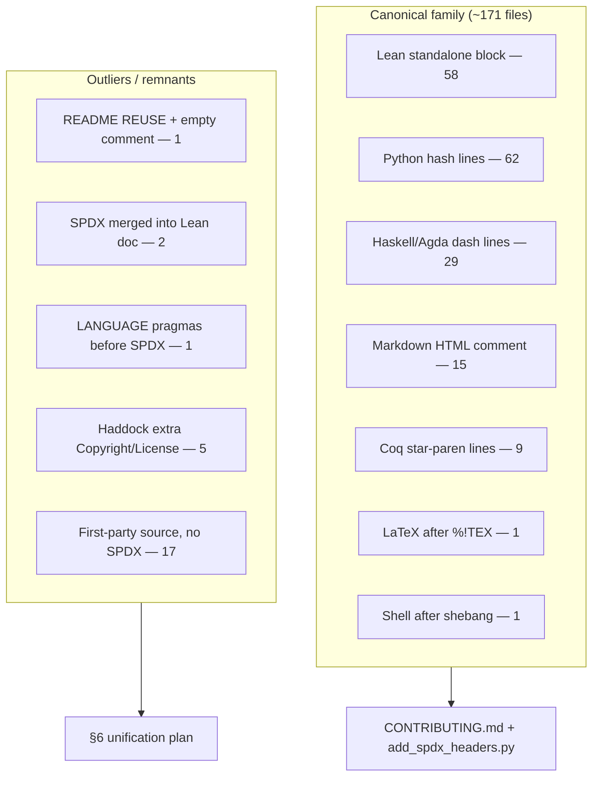

<!--
SPDX-License-Identifier: MIT
Copyright (c) 2026 Santhosh Shyamsundar, Santosh Prabhu Shenbagamoorthy — Studio TYTO
-->

# SPDX header map — kinds, outliers, remnants

Survey of first-party license headers in `umst-formal-double-slit`. **Planning only** — this document does not retarget headers.

**Scanned:** 2026-09-15 (commit `2a90c8b` + this map).  
**Method:** five Composer 2.5 UMST-orch agents (Lean+tools, Haskell, Python/scripts/data, Coq/Agda/Docs, root+CI) plus a mechanical inventory of 216 text files (skipping `.git`, `.lake`, caches, `sim/out` plots).

All SPDX identifiers found are **MIT**. There is no `REUSE.toml`, `.reuse/`, or `LICENSES/` tree.

---

## 1. Canonical form (policy)

[`CONTRIBUTING.md`](../CONTRIBUTING.md) and [`scripts/add_spdx_headers.py`](../scripts/add_spdx_headers.py) agree on one copyright string:

```
Copyright (c) 2026 Santhosh Shyamsundar, Santosh Prabhu Shenbagamoorthy — Studio TYTO
```

Same order and affiliation as root [`LICENSE`](../LICENSE). Comment syntax varies by language; the **two facts** (SPDX MIT + that copyright line) do not.

| Surface | Placement | Wrapper |
|---------|-----------|---------|
| Lean | Very top, before `import` | `/-` … `-/` block of **only** those two lines |
| Python | After shebang (if any), before docstring/imports | `#` lines |
| Haskell | Very top, **before** `{-# LANGUAGE` / Haddock | `--` lines |
| Agda | Very top, before `{-|` / `OPTIONS` | `--` lines |
| Coq | Very top, before any other `(* … *)` banner | `(* … *)` lines |
| LaTeX | After `%!TEX` magic (if any), else line 1 | `%` lines |
| Markdown | File top (invisible on GitHub) | `<!--` … `-->` wrapping the two lines |
| Shell | After shebang | `#` lines (present on `scripts/formal_check.sh`; **not** in the adder script) |

**Do not** treat `LICENSE` / `Haskell/LICENSE` as SPDX-tagged sources. They are the MIT legal text. Cabal `license: MIT` + `copyright:` fields are package metadata, not file headers.

---

## 2. Kind map (what exists)

Counts are **files whose first block matches the kind**, among scanned first-party text files.



### 2.1 Canonical kinds (keep)

| Kind | n | Exact first lines | Where |
|------|--:|-------------------|-------|
| **L** Lean standalone | 58 | `/-` / `SPDX-License-Identifier: MIT` / `Copyright (c) 2026 Santhosh … — Studio TYTO` / `-/` | Almost all `Lean/*.lean` |
| **P+** Python + shebang | ~32 | `#!/usr/bin/env python3` then two `#` SPDX lines | `sim/*.py`, some `scripts/` |
| **P** Python no shebang | 30 | Two `#` SPDX lines | `sim/tests/test_*.py` (except one) |
| **H/A** dash comments | 29 | Two `--` SPDX lines | 18 Haskell `.hs` at top + all 11 Agda `.agda` |
| **MD** HTML comment | 15 | `<!--` / SPDX / Copyright / `-->` | Most docs + package READMEs |
| **C** Coq | 9 | Two `(* … *)` SPDX lines | All `Coq/*.v` |
| **T** LaTeX + magic | 1 | `%!TEX program = pdflatex` then two `%` SPDX lines | `Docs/Preprint/UMST_DoubleSlit_Formal_Verification.tex` |
| **S** Shell | 1 | bash shebang then two `#` SPDX lines | `scripts/formal_check.sh` (manual) |
| **LIC** MIT prose | 2 | `MIT License` + same copyright | `LICENSE`, `Haskell/LICENSE` (byte-identical; Cabal sdist needs the copy) |

### 2.2 Structural variants that still use the canonical string

These are **not** wrong copyright, but they are not the CONTRIBUTING shape.

| Kind | n | Files | Issue |
|------|--:|-------|-------|
| Lean SPDX **merged into module doc** | 2 | `tools/lean_export/ExportCatalog.lean`, `ExportCatalogSmoke.lean` | Extra prose before `-/`; adder would skip (already contains the snippet) |
| Haskell SPDX **after** `LANGUAGE` | 1 | `Haskell/src/TelemetryParser.hs` | Policy: SPDX first |
| Haddock `License : MIT` **plus** SPDX | 4 | `Haskell/{FFI,KleisliDIB,SDFGate,UMST}.hs` | Dual annotation; those five root `.hs` are also **not** in the cabal library |
| Haddock `Copyright : (c) UMST Project, 2026` | 1 | `Haskell/src/EpistemicGalois.hs` | Extra holder; SPDX line itself is canonical |

---

## 3. Outliers (priority)

### P0 — Hero README is the only REUSE-style file

[`README.md`](../README.md) lines 1–5 (introduced in `2a90c8b`, which **replaced** the canonical HTML SPDX block):

```
SPDX-FileCopyrightText: 2026 Santosh Prabhu Shenbagamoorthy and Santhosh Shyamsundar
SPDX-License-Identifier: MIT
<!--
-->
<!-- markdownlint-disable-file … -->
```

| Fact | Canonical | README |
|------|-----------|--------|
| Tag | `Copyright (c) …` inside `<!-- -->` | `SPDX-FileCopyrightText:` (REUSE) at line 1, **outside** HTML |
| Author order | Santhosh, then Santosh | **Santosh, then Santhosh** |
| Affiliation | `— Studio TYTO` | omitted |
| Empty comment | none | leftover `<!--` / `-->` after the rewrite |
| Footer | — | License section `© 2026 .` (names dropped) |

There is **no** REUSE project config. This is an incomplete format switch, not a policy.

`add_spdx_headers.py` **will not repair it**: `_has_spdx_snippet` only looks for `SPDX-License-Identifier: MIT` in the first 1200 characters.

### P0 — Policy file itself has no applied header

[`CONTRIBUTING.md`](../CONTRIBUTING.md) documents the Markdown template but starts with `# Contributing`. The adder **false-skips** it because the **example code fences** contain `SPDX-License-Identifier` inside the first 1200 characters.

### P1 — First-party sources missing SPDX entirely

**Lean (in script scope; a rerun of the adder would prepend):**

| Path | Role |
|------|------|
| `Lean/MatrixLog.lean` | Optional / off default `lakefile` roots |
| `Lean/Test3.lean`, `Lean/Test4.lean`, `Lean/test_tensor_eigen.lean` | Scratch / excluded tests |

**Python (3 in script scope, 1 not):**

| Path | In `add_spdx_headers.py`? |
|------|---------------------------|
| `scripts/lean_declaration_stats.py` | Yes (`scripts/**/*.py`) |
| `sim/monte_carlo_burden.py` | Yes |
| `sim/tests/test_monte_carlo_burden.py` | Yes |
| `data/loaders/adoption_series.py` | **No** — `data/` is not in `py_set` |
| `tools/lean_export/test_export_catalog_cross_repo.py` | **No** — `tools/` is not in `py_set` |

**Markdown (repo-wide `*.md` glob would patch these; CONTRIBUTING would not, see P0):**

- `FORMAL_FOUNDATIONS.md`
- `Docs/COUNT-METHODOLOGY.md`
- `Docs/EXPORT_CANONICAL_PATH.md`
- `Docs/EXPORT_COVERAGE.md`
- `Docs/Quantum-Formal-Primer.md`
- `Docs/UMST_FORMAL_REPOS_ALIGNMENT.md`
- `artifacts/README.md`
- `tools/lean_export/README.md`

### P1 — Adder coverage holes (headers exist only by luck)

| Gap | Consequence |
|-----|-------------|
| `Docs/*.tex` is **non-recursive** | `Docs/Preprint/*.tex` is never touched (currently OK because it was added by hand) |
| No `tools/**` Python | `export_catalog.py` has a header; its test file does not |
| No `data/**` | Loader has no header |
| No `*.sh` | `formal_check.sh` is manual |
| Snippet test is “MIT string anywhere in first N chars” | Cannot normalize README, CONTRIBUTING, or merged Lean doc-blocks |

### P2 — Config / generated / binary (usually leave untagged)

Do **not** treat as source-header debt unless policy explicitly expands:

- `Makefile`, `.gitignore`, `.github/workflows/*.yml`
- `Haskell/cabal.project`, `cabal.project.freeze`, `umst-formal-double-slit.cabal` (has `license:` / `copyright:`)
- `Lean/lean-toolchain`, `Lean/lake-manifest.json`
- `Coq/_CoqProject`, `Agda/umst-formal-double-slit.agda-lib`
- `artifacts/catalog*.json`, `data/samples/*.json`, `data/schemas/*.json`
- `sim/requirements.txt`, `sim/requirements-optional.txt`
- Media, CSV, GIF, PDF, LaTeX `.aux`/`.log`/`.out`

---

## 4. Remnants of the past

These are **lineage traces**, not alternate SPDX licenses.

### 4.1 Incomplete REUSE pass (2026-08-17)

Commit `2a90c8b` (`docs(readme): declarative headings and TOC labels`) swapped README’s HTML SPDX for `SPDX-FileCopyrightText` and left an empty comment. That is the only REUSE tag in the tree.

### 4.2 Deleted tracking docs still cited

CHANGELOG and some comments still name files that are **gone** from this checkout:

- `Docs/PARALLEL_WORK.md` (still mentioned in `Haskell/cabal.project`)
- `Docs/OnePager-DoubleSlit.tex`
- `Docs/GAP_CLOSURE_PLAN.md`, `Docs/TODO-TRACKING.md`, `Docs/REMAINING_WORK_PLAN.md`, `Docs/SORRY_ROADMAP.md`
- `Docs/EPISTEMIC_RUNTIME_GROUNDING.md`
- `Docs/Architecture-Invariants.md` (still referenced from `Haskell/UMST.hs`, `Agda/Gate.agda`)

Header work should not resurrect them; later doc PRs can drop or retarget those links.

### 4.3 Vendored `UMST-Formal:` banners (keep)

Every `Coq/*.v` and most Agda modules still carry an **`UMST-Formal:`** dashed/block banner **after** a canonical SPDX header. That is upstream `umst-formal` / Rust-kernel provenance (`umst-prototype-2a`, `umst-core`), not a second license. Alignment note: [`Docs/UMST_FORMAL_REPOS_ALIGNMENT.md`](UMST_FORMAL_REPOS_ALIGNMENT.md) already records that vendored Lean copies gained SPDX and are **not** byte-identical to upstream.

### 4.4 Haskell layout fossils

| Remnant | Paths |
|---------|-------|
| Package-root modules **not** in the cabal library | `Haskell/{FFI,InfoTheory,KleisliDIB,SDFGate,UMST}.hs` |
| Shadowed duplicates parked for GHC `-i` | `Haskell/legacy/{LandauerExtension,MeasurementCost,MonoidalState}.hs` + `legacy/README.md` |
| Extra Haddock copyright | `src/EpistemicGalois.hs` — `(c) UMST Project, 2026` |

SPDX on those files is canonical; the **layout** is the remnant.

### 4.5 Preprint / ignore mismatch

`.gitignore` ignores `Docs/*.aux` (one directory deep) but **not** `Docs/Preprint/*.{aux,log,out,pdf}`. Those build products are currently committed. Unrelated to SPDX text, same “old glob” class of remnant.

### 4.6 In-body copyright variants (preprint only)

`Docs/Preprint/UMST_DoubleSlit_Formal_Verification.tex` has a canonical SPDX header, then:

- `\copyright 2026 Studio TYTO` (entity only)
- `pdfauthor` with prose `and`
- bibliography `Shenbagamoorthy and Shyamsundar` (reversed)

Do not “fix” bibliography order as if it were a file header.

### 4.7 Dual Lean stats scripts

`scripts/lean_decl_stats.py` (SPDX) vs `scripts/lean_declaration_stats.py` (no SPDX). Naming remnant; the longer name is what CHANGELOG / `FORMAL_FOUNDATIONS.md` cite.

---

## 5. Author-string inventory

| Form | Occurrences |
|------|-------------|
| `2026 Santhosh Shyamsundar, Santosh Prabhu Shenbagamoorthy — Studio TYTO` | **171** SPDX/copyright headers (all languages) |
| Same inside Coq `(* … *)` | **9** (same string, different wrapper) |
| `2026 Santosh Prabhu Shenbagamoorthy and Santhosh Shyamsundar` | **1** — README `SPDX-FileCopyrightText` |
| `(c) UMST Project, 2026` | **1** — Haddock in `EpistemicGalois.hs` |
| `© 2026 .` | **1** — README License section |

No other years. No non-MIT SPDX ids.

---

## 6. Unification plan (recommended, not done here)

Keep **CONTRIBUTING + `LICENSE` as SSOT**. Do **not** adopt full REUSE unless the whole stack (`umst-formal`, manifold, …) agrees — README already proved a half-migration is worse than the HTML-comment convention.

### Phase A — Repair the hero and the adder (small, high leverage)

1. Restore README to canonical Markdown SPDX (`<!--` / two lines / `-->`), keep the `markdownlint-disable-file` comment **after** that block, delete the empty `<!-- -->`.
2. Fix README License footer `© 2026 .` to the LICENSE names + Studio TYTO.
3. Tighten `add_spdx_headers.py`:
   - Detect headers only in a **leading** window that ignores shebang / `%!TEX` / `LANGUAGE` pragmas, **not** “string anywhere in 1200 chars”.
   - Do not treat fenced examples in CONTRIBUTING as “already licensed”.
   - Recurse `Docs/**/*.tex`; add `tools/**/*.py` and `data/**/*.py`.
4. Add a real SPDX header to `CONTRIBUTING.md` (manual or after the detector fix).

### Phase B — Close first-party gaps (mechanical)

1. Run the (fixed) adder for missing Lean / Python / Markdown listed in §3 P1.
2. Move SPDX above `LANGUAGE` in `TelemetryParser.hs`.
3. Split the tools Lean export files so the SPDX block is standalone (doc text after `-/`).
4. Drop or replace Haddock `Copyright : (c) UMST Project, 2026` in `EpistemicGalois.hs`.

### Phase C — Policy decisions (human)

| Question | Suggestion |
|----------|------------|
| SPDX on `Makefile` / GitHub Actions? | Optional; low value; many orgs skip YAML |
| SPDX on JSON catalogs / schemas? | No — generated or data |
| SPDX on `_CoqProject` / `.agda-lib` / `lean-toolchain`? | No |
| Keep `UMST-Formal:` Coq/Agda banners? | Yes — provenance, not license |
| Haskell root + `legacy/` modules? | Separate layout PR, not a header PR |
| Commit Preprint `.aux`/`.log`/`.out`? | Gitignore `Docs/Preprint/` build products |
| Full [REUSE](https://reuse.software/) (`SPDX-FileCopyrightText` + `REUSE.toml`)? | Only if sibling repos do; otherwise revert README to CONTRIBUTING |

### Phase D — Guardrail (optional)

A cheap CI grep: every `Lean/*.lean`, `sim/**/*.py`, `scripts/**/*.py`, `Haskell/**/*.hs`, `Coq/*.v`, `Agda/*.agda` must contain `SPDX-License-Identifier: MIT` in the first 20 lines (with shebang/`LANGUAGE` exceptions). Do **not** require it on `LICENSE`, lockfiles, or `artifacts/*.json`.

---

## 7. Agent partition (this survey)

| Agent | Tree | Headline |
|-------|------|----------|
| Lean+tools | `Lean/`, `tools/` | 58/62 Lean files canonical; 4 scratch Lean untagged; `tools/` mostly outside the adder |
| Haskell | `Haskell/` | 19/19 `.hs` have SPDX; 1 placement violation; legacy/root fossils |
| Python | `sim/`, `scripts/`, `data/` | 62/66 `.py` canonical; Monte Carlo + dual stats script + `data/` loader |
| Coq/Agda/Docs | those trees | `.v` / `.agda` 100% canonical; 5 Docs markdown untagged; preprint tex OK but not script-managed |
| Root+CI | README, LICENSE, `.github`, artifacts | README is the unique REUSE remnant; workflows untagged |

Mechanical scan: **180** files with `SPDX-License-Identifier: MIT`, **36** scanned text files without (most are config/generated; **17** are first-party source/docs listed above).
