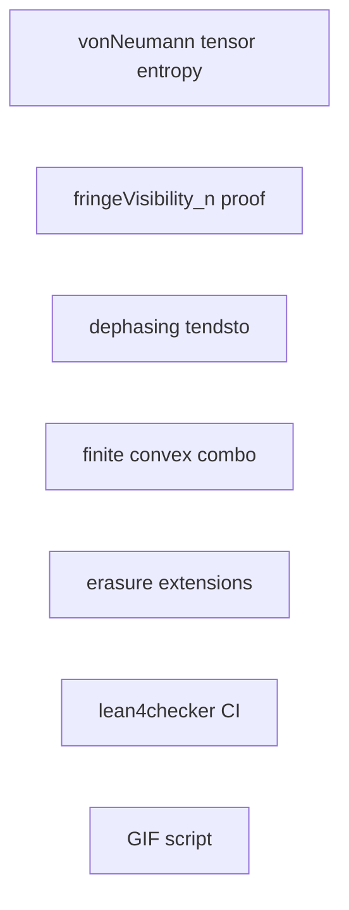

<!--
SPDX-License-Identifier: MIT
Copyright (c) 2026 Santhosh Shyamsundar, Santosh Prabhu Shenbagamoorthy — Studio TYTO
-->

# Parallel (“swarm”) work split

Use this to assign **independent** tracks to agents or humans. Each track should end with **`lake build`** (Lean) or **`python3 -m unittest`** (Python) where applicable.

## Track A — Lean: tensor entropy axiom (hard)

**Goal:** Prove `vonNeumannEntropy_tensorDensity` in `Lean/QuantumMutualInfo.lean` and remove the axiom.

**Inputs:** `VonNeumannEntropy.lean`, `TensorPartialTrace.lean`, Mathlib spectrum / Kronecker.

**Blocker class:** Mathlib Kronecker–spectrum glue (not a quick PR).

## Track B — Lean: general visibility bound (medium)

**Goal:** Replace `fringeVisibility_n_le_one` axiom in `Lean/GeneralVisibility.lean` with a proof (Schur minors + Cauchy–Schwarz on off-diagonals).

**Independent of** Track A.

## Track C — Lean: dephasing limit (small)

**Goal:** Replace `dephasingSolution_tendsto_diagonal` in `Lean/LindbladDynamics.lean` with `Filter.Tendsto` using `Real.tendsto_exp_neg_atTop_nhds_zero` and complex continuity.

**Imports:** add minimal topology for `nhds` / `Tendsto` on `ℂ`.

## Track D — Lean: finite convex combinations (medium)

**Goal:** In `DensityState.lean`, `convexComboDensity` for `∑ wᵢ = 1`, `wᵢ ≥ 0`, family of `DensityMatrix`.

## Track E — Lean: concrete erasure (done / extend)

**Status:** `ErasureChannel.lean` already has reset channel + `idealResetErasure`.

**Optional extension:** entropy **drop** along reset for a named input (e.g. `rhoPlus`):  
`vonNeumannDiagonal ρ - vonNeumannDiagonal (reset ρ) = log 2`.

## Track F — Lean: QMI + DPI (mostly done)

**Status:** `QuantumMutualInfo.lean` defines QMI; product state uses axiom `vonNeumannEntropy_tensorDensity`.  
**Nonneg / subadditivity** still tied to Klein (same as full DPI).

## Track G — Lean: biconditional fringes (done)

**Status:** `fringeVisibility_eq_zero_iff`, `fringeVisibility_pos_iff`, `collapse_all_fringes_iff_zeros_offdiag` are in-tree.

## Track H — CI: lean4checker (infra)

**Status:** Step added to `.github/workflows/lean.yml` after `lake build`.

**Agent task:** If CI fails (toolchain mismatch), pin `lean4checker` revision or toolchain to match `Lean/lean-toolchain`.

## Track I — Scripts: PDE GIF export (infra)

**Status:** `scripts/generate_sim_gifs.py` + `make sim-gifs-validate`.

**Requires:** `pip install numpy matplotlib imageio` (optional locally; CI already installs optional sim deps).

## Dependency graph (what can run in parallel)

Tracks **A–E** are pairwise parallel except none blocks **H** or **I**.
