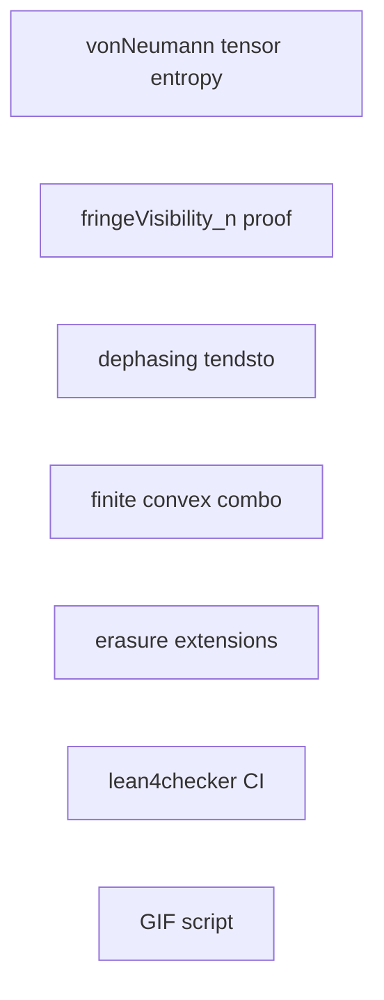

<!--
SPDX-License-Identifier: MIT
Copyright (c) 2026 Santhosh Shyamsundar, Santosh Prabhu Shenbagamoorthy — Studio TYTO
-->

# Parallel (“swarm”) work split

Use this to assign **independent** tracks to agents or humans. Each track should end with **`lake build`** (Lean) or **`python3 -m unittest`** (Python) where applicable.

**Example split:** one agent on **Track A** (tensor entropy / Kronecker spectrum), another on **Track B** (visibility), a third on **Tracks C+D** (dephasing limit + convex combos) — they touch different files and merge cleanly. **Tracks B, C, D** are now **closed** in `cursor/quantum-formalism-gaps-3118` (see git log).

## Track A — Lean: tensor entropy axiom (hard)

**Goal:** Prove `vonNeumannEntropy_tensorDensity` in `Lean/QuantumMutualInfo.lean` and remove the axiom.

**Inputs:** `VonNeumannEntropy.lean`, `TensorPartialTrace.lean`, Mathlib spectrum / Kronecker.

**Blocker class:** Mathlib Kronecker–spectrum glue (not a quick PR).

## Track B — Lean: general visibility bound — **DONE**

**Theorem:** `fringeVisibility_n_le_one` in `Lean/GeneralVisibility.lean` (PSD `2 × 2` minors + Cauchy–Schwarz on `√pᵢ`).

**Independent of** Track A.

## Track C — Lean: dephasing limit — **DONE**

**Theorem:** `dephasingSolution_tendsto_diagonal` in `Lean/LindbladDynamics.lean` (`Real.tendsto_exp_neg_atTop_nhds_zero` + `Tendsto` on `ℂ`).

## Track D — Lean: finite convex combinations — **DONE**

**Defs / lemmas:** `convexComboDensity`, `mixedDensity_eq_convexCombo_two` in `Lean/DensityState.lean` (plus `MeasurementChannel` `posSemidef_sum` alignment).

## Track E — Lean: concrete erasure (done / extend)

**Status:** `ErasureChannel.lean` has reset channel, `idealResetErasure`, and `resetChannel_entropy_drop_from_rhoPlus`.

## Track F — Lean: QMI + DPI (mostly done)

**Status:** `QuantumMutualInfo.lean` defines QMI; product state uses axiom `vonNeumannEntropy_tensorDensity`.  
**Nonneg / subadditivity** still tied to Klein (same as full DPI).

## Track G — Lean: biconditional fringes (done)

**Status:** `fringeVisibility_eq_zero_iff`, `fringeVisibility_pos_iff`, `collapse_all_fringes_iff_zeros_offdiag` are in-tree.

## Track H — CI: lean4checker (infra)

**Status:** Step added to `.github/workflows/lean.yml` after `lake build`.

**Agent task:** If CI fails (toolchain mismatch), pin `lean4checker` revision or toolchain to match `Lean/lean-toolchain`.

## Track I — Scripts: PDE GIF export (infra)

**Status:** `scripts/generate_sim_gifs.py` + `make sim-gifs-validate`.

**Requires:** `pip install numpy matplotlib imageio` (optional locally; CI already installs optional sim deps).

## Dependency graph (what can run in parallel)

Tracks **A–E** are pairwise parallel except none blocks **H** or **I**.
