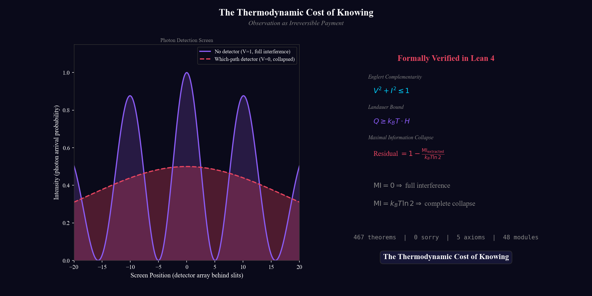
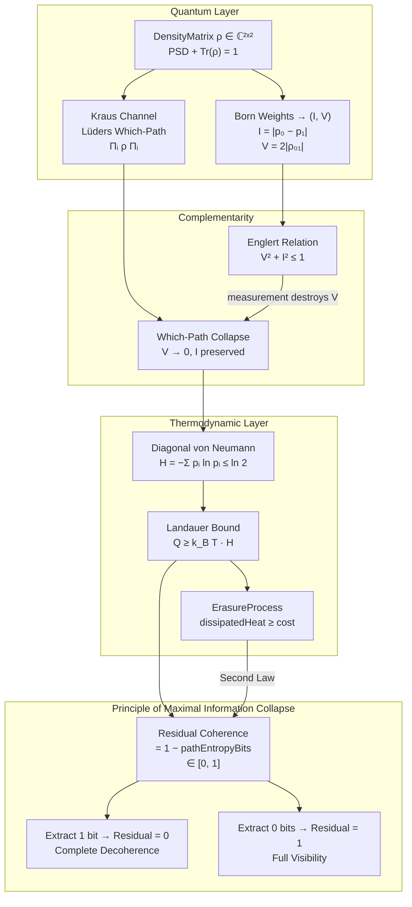

<!--
SPDX-License-Identifier: MIT
Copyright (c) 2026 Santhosh Shyamsundar, Santosh Prabhu Shenbagamoorthy — Studio TYTO
-->

<div align="center">

# The Thermodynamic Cost of Knowing

### Observation as Irreversible Payment

[](https://doi.org/10.5281/zenodo.19159660)
[](https://github.com/tytolabs/umst-formal-double-slit/actions/workflows/lean.yml)
[](https://github.com/tytolabs/umst-formal-double-slit/actions/workflows/haskell.yml)
[](https://github.com/tytolabs/umst-formal-double-slit/actions/workflows/formal.yml)
[](LICENSE)

**Formally verified in Lean 4 + Mathlib&ensp;·&ensp;**0** tactic `sorry` in default `lake` roots&ensp;·&ensp;**1** Lean axiom (`physicalSecondLaw` — `FORMAL_FOUNDATIONS.md`)&ensp;·&ensp;Visibility + dephasing limits **proved** (`GeneralVisibility`, `LindbladDynamics`)&ensp;·&ensp;Klein relative-entropy nonnegativity **proved** (`KleinInequality.lean`)&ensp;·&ensp;**533** theorems + **34** lemmas in **58** roots; **542** + **35** over all `Lean/*.lean` (`python3 scripts/lean_declaration_stats.py`)**

_Observation has a price. Every fraction of a bit extracted destroys a corresponding fraction of interference._
_The thermodynamic cost is exact, non-negotiable, and formally verified._

<br>

<picture>
  <source media="(prefers-color-scheme: dark)" srcset="Docs/Media/teaser.png">
  <source media="(prefers-color-scheme: light)" srcset="Docs/Media/teaser.png">
  
</picture>

<br>


<sub>As which-path information I rises from 0 → 1, the interference pattern collapses along the Englert curve V = √(1 − I²).<br>Every frame is a theorem. Machine-checked in Lean 4.</sub>

<br>

| | |
|:---:|:---:|
| **58** Lean modules (`lakefile` roots) | **533** `theorem` + **34** `lemma` (roots-only; line-start) |
| **0** tactic sorry, **1** axiom (`physicalSecondLaw`) | Visibility + dephasing: **theorems**; qubit-tier results proved |
| **87** Python unit tests | **14** Haskell QuickCheck properties |
| **5** languages | Lean 4 · Haskell · Python · Coq · Agda |

</div>

---

## Core Result

### In plain language

Extracting which-path information from a quantum system destroys interference. The destruction is proportional, not binary. Extract 0.3 bits of path information and visibility drops to ≈ 0.95. Extract 0.7 bits and it drops to ≈ 0.71. Extract the full bit and the interference pattern is gone entirely. This is the Englert complementarity relation, V² + I² ≤ 1. Every point on the curve is physically realizable.

Each fraction of information extracted carries a thermodynamic cost at Landauer's scale — *k_B T ln 2* per bit, minimum, irreversible. This is not a matter of interpretation. It is thermodynamic accounting, enforced by the second law.

This repository proves the full chain: density matrix → Kraus measurement channel → Englert complementarity → diagonal von Neumann entropy → Landauer bound → cost–coherence identity. **533 theorems** in default roots (**567** with lemmas); **0** tactic `sorry`; **1** explicit Lean axiom (**physical second law** — `LandauerLaw.lean`). General-**n** visibility bound and dephasing diagonal limit are **theorems** (`GeneralVisibility`, `LindbladDynamics` — see `FORMAL_FOUNDATIONS.md`). **Spectral relative entropy ≥ 0** is **proved** in `KleinInequality.lean`.

**Relevance beyond quantum optics.** Any system that extracts information from a physical process — sensing, control, inference, materials gating, computing — is subject to the same thermodynamic constraint. This repository is the formal proof of that constraint, machine-checked in four languages.

---

### Formal statement

> **Principle of Maximal Information Collapse.**&ensp;When an observer extracts which-path information from a quantum system, the residual coherence capacity is:
>
> ```
> Residual Coherence = 1 − MI_extracted / (k_B T ln 2)  ∈ [0, 1]
> ```
>
> Extract **0 bits** ⟹ full interference.&ensp;Extract **1 bit** ⟹ complete decoherence.
>
> **Crucially, observation is not binary.** A probe extracting 0.3 bits barely disturbs the fringes (V ≈ 0.95). At 0.7 bits the pattern is heavily suppressed (V ≈ 0.71). Full collapse requires the _entire_ bit. Every point on the Englert curve V² + I² = 1 is physically realizable, and each carries a proportional Landauer cost. The collapse is a _continuum_, not a switch.
>
> _Machine-checked in Lean 4 with Mathlib. **533 theorem + 34 lemmas in 58 roots; 542 + 35 over all Lean/*.lean; 0 tactic sorry; 1 axiom (`physicalSecondLaw`). Klein `spectralRelativeEntropy_nonneg` proved; tensor additivity in `KroneckerEigen.lean`.**_

<details>
<summary><strong>Show me the proof</strong> — key theorem in Lean 4</summary>

```lean
-- Lean/LandauerBound.lean, line 140
theorem principle_of_maximal_information_collapse (ρ : DensityMatrix hnQubit) :
    0 ≤ residualCoherenceCapacity ρ ∧ residualCoherenceCapacity ρ ≤ 1 :=
  ⟨residualCoherenceCapacity_nonneg ρ, residualCoherenceCapacity_le_one ρ⟩

-- When path entropy is maximal (1 bit), residual coherence collapses to zero.
theorem maximal_extraction_collapses_coherence (ρ : DensityMatrix hnQubit)
    (h : pathEntropyBits ρ = 1) : residualCoherenceCapacity ρ = 0 := by
  unfold residualCoherenceCapacity; linarith

-- When no path information is extracted, full coherence capacity remains.
theorem null_extraction_preserves_coherence (ρ : DensityMatrix hnQubit)
    (h : pathEntropyBits ρ = 0) : residualCoherenceCapacity ρ = 1 := by
  unfold residualCoherenceCapacity; linarith
```

→ [`Lean/LandauerBound.lean`](Lean/LandauerBound.lean) · [Proof / module map](Lean/VERIFY.md) · [`PROOF-STATUS.md`](PROOF-STATUS.md) (counts)

</details>

---

## What This Repository Proves

A formally verified bridge from quantum measurement theory to classical thermodynamics — closing the loop between wave-particle duality, Landauer erasure, and decoherence:

| # | Theorem | Statement | Lean Module |
|:-:|---------|-----------|-------------|
| 1 | **Englert complementarity** | V² + I² ≤ 1 | `QuantumClassicalBridge` |
| 2 | **Which-path collapse** | V → 0 after Lüders channel | `MeasurementChannel` |
| 3 | **Projector properties** | self-adjoint, idempotent, orthogonal, TP | `MeasurementChannel` |
| 4 | **Density matrix diagonals** | PSD ⟹ pᵢ ≥ 0, Σpᵢ = 1, pᵢ ≤ 1 | `DensityState` |
| 5 | **Diagonal entropy bound** | H_diag ≤ ln 2 | `InfoEntropy` |
| 6 | **Landauer cost cap** | cost ≤ k_B T ln 2 | `LandauerBound` |
| 7 | **Path entropy ≤ 1 bit** | S_bits ∈ [0, 1] | `LandauerBound` |
| 8 | **Maximal collapse** | S_bits = 1 ⟹ Residual = 0 | `LandauerBound` |
| 9 | **Null preservation** | S_bits = 0 ⟹ Residual = 1 | `LandauerBound` |
| 10 | **Cost–coherence identity** | Q = k_B T ln 2 · (1 − Residual) | `LandauerBound` |
| 11 | **Erasure ≥ bound** | dissipatedHeat ≥ landauerCostDiagonal | `LandauerBound` |
| 12 | **Which-path invariance** | Landauer cost unchanged by measurement | `LandauerBound` |
| 13 | **Gate enforcement** | admissibility + Landauer + cap in one | `DoubleSlit` |
| 14 | **PMIC visibility** | `V² + residualCoherenceCapacity ≤ 1` | `PMICVisibility` + `PMICEntropyInterior` |
| 15 | **ℚ → ℝ gate lift** | `Admissible` preserved under cast | `QRBridge` |

---

## Proof Architecture



---

## Repository layout

```
umst-formal-double-slit/
│
├── Lean/                          ← 58 lakefile roots · 533 thm + 34 lem (roots) · 542 + 35 (all Lean/*.lean) · 1 axiom · 68 .lean files
│   │
│   ├── ── Quantum core (18 modules) ─────────────────────────────────────────────────────────
│   │   ├── UMSTCore.lean                  ℝ SI constants, Landauer bit energy, Admissible
│   │   ├── DensityState.lean              DensityMatrix, PSD, trace-one, diagonal bounds
│   │   ├── MeasurementChannel.lean        Kraus channels, Lüders which-path, projector algebra
│   │   ├── QuantumClassicalBridge.lean    V² + I² ≤ 1, canonical observation state
│   │   ├── InfoEntropy.lean               shannonBinary, vonNeumannDiagonal ≤ log 2
│   │   ├── LandauerBound.lean             PMIC, residualCoherenceCapacity ∈ [0,1], ErasureProcess
│   │   ├── PMICEntropyInterior.lean       entropy ≥ 4x(1−x)log2 on (0,½) — MVT proof
│   │   ├── PMICVisibility.lean            V² + residualCoherenceCapacity ≤ 1
│   │   ├── DoubleSlit.lean                full-chain import root, gate enforcement
│   │   ├── WhichPathMeasurementUpdate.lean  measurementUpdateWhichPath (split from DoubleSlit)
│   │   ├── GeneralDimension.lean          vonNeumannDiagonal_n ≤ log n (Fin n)
│   │   ├── GeneralResidualCoherence.lean  RCC_n ∈ [0,1], Cauchy–Schwarz from first principles
│   │   ├── GeneralVisibility.lean         fringeVisibility_n (ℓ₁ norm, Fin n); theorem fringeVisibility_n_le_one
│   │   ├── QuantumMutualInfo.lean         I(A:B) = S(A)+S(B)−S(AB); upper bound; product-state zero
│   │   ├── ErasureChannel.lean            reset-to-|0⟩ Kraus; idealResetErasure at Landauer equality
│   │   ├── TensorPartialTrace.lean        tensorDensity, partial traces, Kronecker PSD
│   │   ├── VonNeumannEntropy.lean         S(ρ) spectral; unitary invariance proved for all Fin n
│   │   └── DataProcessingInequality.lean  qubit-tier unital DPI instances proved; general-n CPTP DPI not one theorem
│   │
│   ├── ── Dynamics & sim contracts (3 modules) ─────────────────────────────────────────────
│   │   ├── SchrodingerDynamics.lean       unitary as single-Kraus; DensityMatrix closure
│   │   ├── LindbladDynamics.lean          Lindblad dissipator; dephasing limit (theorem dephasingSolution_tendsto_diagonal)
│   │   └── SimLeanBridge.lean             trust-boundary contracts for sim/ outputs
│   │
│   ├── ── Epistemic sensing stack (8 modules) ──────────────────────────────────────────────
│   │   ├── EpistemicSensing.lean          QuantumProbe, nullProbe/whichPathProbe, collapse/preserve
│   │   ├── EpistemicMI.lean               PathProbe, MI in nats/bits, Landauer links
│   │   ├── EpistemicDynamics.lean         policy rollouts, null/which-path invariants
│   │   ├── EpistemicTrajectoryMI.lean     cumulative MI/cost, finite upper bounds
│   │   ├── EpistemicPolicy.lean           utility argmax, constrained optimality
│   │   ├── EpistemicGalois.lean           info extractable ↔ energy deployed (Galois adjunction)
│   │   ├── ProbeOptimization.lean         cost-penalized finite probe selection
│   │   └── ExamplesQubit.lean             worked examples: |+⟩, |0⟩, |1⟩
│   │
│   ├── ── Runtime contract stack (11 modules) ──────────────────────────────────────────────
│   │   ├── EpistemicRuntimeContract.lean              trace coherence → policy bridge
│   │   ├── EpistemicNumericsContract.lean             numeric aggregate → utility equivalence
│   │   ├── EpistemicPerStepNumerics.lean              per-step fold → cumulative consistency
│   │   ├── EpistemicRuntimeSchemaContract.lean        emitted schema → contract transfer
│   │   ├── EpistemicTelemetryBridge.lean              runtime naming bridge (trajMI, effortCost)
│   │   ├── EpistemicTelemetryApproximation.lean       ε-approximation with zero-error collapse
│   │   ├── EpistemicTelemetryQuantitativeUtility.lean nonzero-error deviation bounds
│   │   ├── EpistemicTraceDerivedEpsilonCertificate.lean  residual-based ε extraction
│   │   ├── EpistemicTelemetrySolverCalibration.lean   solver params → ε budgets
│   │   ├── EpistemicTraceDrivenCalibrationWitness.lean   trace + calibration → utility bounds
│   │   └── PrototypeSolverCalibration.lean            concrete instantiation (step=1/100, order=2)
│   │
│   └── ── Classical / upstream integration (13 modules) ────────────────────────────────────
│       ├── DoubleSlitCore.lean            coarse MeasurementUpdate skeleton
│       ├── GateCompat.lean                Born weights → ThermodynamicState scaffold
│       ├── QRBridge.lean                  ℚ → ℝ Admissible lift
│       ├── Complementarity.lean           discoverability shims over QuantumClassicalBridge
│       ├── MeasurementCost.lean           probe costs vs Landauer bit-energy cap
│       ├── Gate.lean                      ← vendored: ℚ ThermodynamicState, Admissible
│       ├── Naturality.lean                ← vendored: material-agnostic gate lemmas
│       ├── Activation.lean                ← vendored: Engine, activation, totality
│       ├── FiberedActivation.lean         ← vendored: engineFiber, universality
│       ├── MonoidalState.lean             ← vendored: combine on ℚ ThermodynamicState
│       ├── LandauerLaw.lean               ← vendored: physicalSecondLaw axiom, Shannon Fin n
│       ├── LandauerExtension.lean         ← vendored: temp scaling, n-bit bound, 300 K
│       └── LandauerEinsteinBridge.lean    ← vendored: SI k_B, c, mass brackets at 300 K
│
├── sim/                           ← Python · 87 unit tests · 4 sim scripts
│   ├── toy_double_slit_mi_gate.py         MI-gate sweep → CSV + SVG
│   ├── qubit_kraus_sweep.py               identity vs Lüders on |+⟩, |0⟩, |1⟩
│   ├── plot_complementarity_svg.py        quarter-disk V²+I²≤1 diagram (stdlib)
│   ├── plot_toy_complementarity_svg.py    toy CSV → SVG (stdlib)
│   ├── export_sample_telemetry_trace.py   Gap 14 — golden JSON telemetry
│   ├── telemetry_trace_consumer.py        pydantic contract validator
│   ├── schrodinger_1d_*.py                1D FFT/split-step solvers
│   ├── schrodinger_2d_*.py                2D split-step + PML
│   ├── schrodinger_3d_split_step.py       3D FFT split-step
│   ├── qutip_*.py                         QuTiP parity checks (optional)
│   ├── tests/                             87 unittest files
│   └── requirements-optional.txt          NumPy, SciPy, matplotlib, imageio, QuTiP
│
├── scripts/
│   ├── generate_sim_gifs.py               1D/2D wave GIFs (make sim-gifs)
│   ├── generate_spectacular_gif.py        Docs/Media/double-slit-collapse.gif + teaser
│   ├── lean_declaration_stats.py        lake roots + line-start theorem/lemma + ^axiom (authoritative)
│   └── lean_decl_stats.py                 full-tree heuristic (legacy; label outputs)
│
├── Haskell/                       ← 8 modules · 14 QuickCheck properties
├── Coq/                           ← 9 .v modules (make coq-check; axioms in VonNeumannEntropySpec.v, no Admitted)
├── Agda/                          ← 11 entry modules (make agda-check; clean typecheck)
├── Docs/                          ← Mathematical-Foundations.md, ASSUMPTIONS, PROVENANCE, Preprint/
├── PROOF-STATUS.md                ← canonical declaration counts + axiom inventory
├── Lean/VERIFY.md                 ← full module map + sorry/axiom map + key theorem names
├── CHANGELOG.md
└── Makefile                       ← lean · sim · sim-gifs · haskell-test · coq-check · agda-check · ci-*
```

> **Counting the numbers:** Authoritative: `python3 scripts/lean_declaration_stats.py` — **58** `lean_lib` roots, **533** + **34** line-start `theorem`/`lemma` summed over those roots (**567** total declarations), **542** + **35** over all `Lean/*.lean` (**577**), **1** `^axiom ` (**`physicalSecondLaw`**). See **`Docs/COUNT-METHODOLOGY.md`** and **`FORMAL_FOUNDATIONS.md`**. Legacy full-tree scan: `make lean-stats-md` → `lean_decl_stats.py` (label “full-tree heuristic”). Verify: `cd Lean && lake build`.

---

## Lean modules (58 `lakefile` roots, `lake build` — see `Lean/VERIFY.md` for `sorry` / axiom map)
*(Counts: **`python3 scripts/lean_declaration_stats.py`** → roots-only **533** / **34**; all-`Lean/*.lean` **542** / **35**; **1** project axiom — see **`PROOF-STATUS.md`**. Many are small/interface lemmas; headline chain is PMIC + double-slit.)*

<details>
<summary><strong>Quantum core</strong> — density matrices, Kraus channels, complementarity, entropy, Landauer</summary>

| Module | Key theorems |
|--------|-------------|
| `DensityState` | `DensityMatrix`, `pureDensity`, diagonal non-negativity, trace-one, bound-by-one (all proved) |
| `MeasurementChannel` | Kraus channels, `whichPathChannel`, `compose`, projector self-adjoint/idempotent/orthogonal (all proved) |
| `QuantumClassicalBridge` | `complementarity_fringe_path` (V² + I² ≤ 1), `observationStateCanonical` |
| `InfoEntropy` | `shannonBinary = Real.binEntropy`, `vonNeumannDiagonal ≤ log 2` |
| `LandauerBound` | `pathEntropyBits ≤ 1`, `principle_of_maximal_information_collapse`, `ErasureProcess` |
| `PMICEntropyInterior` | `four_mul_x_one_sub_x_mul_log_two_interior` — binary entropy ≥ `4x(1-x) log 2` on `(0,1/2)` (MVT + ratio monotonicity) |
| `PMICVisibility` | `visibility_sq_le_coherence_capacity` — `V² + residualCoherenceCapacity ≤ 1` |
| `DoubleSlit` | Gate enforcement, Landauer cap; full-chain import root |
| `WhichPathMeasurementUpdate` | `measurementUpdateWhichPath` (Lüders update, fringe collapse, Landauer invariance) |
| `GeneralDimension` | `vonNeumannDiagonal_n_le_log_n` (diagonal entropy ≤ `log n`) |
| `GeneralResidualCoherence` | `RCC_n ∈ [0,1]`; purity-based formula; Cauchy-Schwarz from first principles; qubit compatibility |
| `QuantumMutualInfo` | `I(A:B) = S(A)+S(B)−S(AB)`; upper bound `≤ log nA + log nB`; product-state zero |
| `ErasureChannel` | Reset-to-`\|0⟩` Kraus channel; trace preservation; `idealResetErasure` at Landauer equality |
| `GeneralVisibility` | `fringeVisibility_n` ($\ell_1$ norm of coherence for `Fin n`); `fringeVisibility_n_nonneg`; `fringeVisibility_n_whichPath_apply` |
| `TensorPartialTrace` | `tensorDensity`, partial traces, Kronecker PSD lemmas |
| `VonNeumannEntropy` | Spectral `S(ρ)`; `Fin 1`/`Fin 2`/general `Fin n` unitary invariance **proved**; `charpoly` conjugation (`Lean/VERIFY.md`) |
| `DataProcessingInequality` | Qubit diagonal ≥ spectral; identity-channel unital base; general unital CPTP DPI **not** one theorem here (`Lean/VERIFY.md`) |

</details>

<details>
<summary><strong>Dynamics & Lean↔sim contracts</strong> — unitary Kraus, Lindblad dephasing, numeric witness shapes</summary>

| Module | Role |
|--------|------|
| `SchrodingerDynamics` | Unitary `U` as single-Kraus channel; `UρUᴴ` preserves `DensityMatrix` |
| `LindbladDynamics` | Lindblad dissipator; which-path as strong dephasing limit; `dephasingSolution_tendsto_diagonal` |
| `SimLeanBridge` | Propositional contracts (`SimDensityContract`, complementarity/Landauer witnesses) for `sim/` outputs |

</details>

<details>
<summary><strong>Epistemic sensing stack</strong> — probes, mutual information, policy optimization</summary>

| Module | Purpose |
|--------|---------|
| `EpistemicSensing` | Probe interface, `nullProbe`/`whichPathProbe`, collapse/preserve bridges |
| `EpistemicMI` | Probe-indexed MI in nats/bits + Landauer links |
| `EpistemicDynamics` | Policy rollouts with null/which-path invariants |
| `EpistemicTrajectoryMI` | Cumulative MI/cost with finite upper bounds |
| `EpistemicPolicy` | Finite-horizon utility argmax + constrained optimality |
| `EpistemicGalois` | Galois connection: info extractable ↔ energy deployed |
| `ProbeOptimization` | Cost-penalized finite probe selection |
| `ExamplesQubit` | Worked examples: \|+⟩, \|0⟩, \|1⟩ |

</details>

<details>
<summary><strong>Runtime contract stack</strong> — telemetry, numerics, solver calibration</summary>

| Module | Purpose |
|--------|---------|
| `EpistemicRuntimeContract` | Trace coherence → policy theorem bridge |
| `EpistemicNumericsContract` | Numeric aggregate record → utility equivalence |
| `EpistemicPerStepNumerics` | Per-step fold → cumulative consistency |
| `EpistemicRuntimeSchemaContract` | Emitted schema → contract transfer |
| `EpistemicTelemetryBridge` | Runtime naming bridge (`trajMI`, `effortCost`) |
| `EpistemicTelemetryApproximation` | Epsilon-approximation with zero-error collapse |
| `EpistemicTelemetryQuantitativeUtility` | Nonzero-error deviation bounds |
| `EpistemicTraceDerivedEpsilonCertificate` | Residual-based epsilon extraction |
| `EpistemicTelemetrySolverCalibration` | Solver params → epsilon budgets |
| `EpistemicTraceDrivenCalibrationWitness` | Trace + calibration → utility bounds |
| `PrototypeSolverCalibration` | Concrete instantiation (step=1/100, order=2) |

</details>

<details>
<summary><strong>Classical / upstream integration</strong> — UMST core, gate compatibility, vendored modules</summary>

| Module | Purpose |
|--------|---------|
| `UMSTCore` | ℝ SI constants, Landauer bit energy, `ThermodynamicState`, `Admissible` |
| `DoubleSlitCore` | Coarse `MeasurementUpdate` skeleton |
| `GateCompat` | Born weights → `ThermodynamicState` scaffold |
| `QRBridge` | ℚ `Gate.ThermodynamicState` → ℝ `UMSTCore.ThermodynamicState`; `admissible_thermodynamicStateToReal` |
| `Complementarity` | Discoverability shims |
| `Gate`, `Naturality`, `Activation`, `FiberedActivation`, `MonoidalState` | Upstream ℚ core (vendored) |
| `LandauerLaw`, `LandauerExtension`, `LandauerEinsteinBridge` | Upstream Landauer stack (vendored) |

</details>

---

## Cross-Language Verification

Every claim is checked in at least two languages. Phase 1 PMIC entropy–quadratic bound is closed in `Lean/PMICEntropyInterior.lean` (module map: `Lean/VERIFY.md`).

| Language | Artifact | Status | Command |
|:--------:|----------|:------:|---------|
| **Lean 4** | 58 roots, 533 thm + 34 lem (roots); 542 + 35 all `Lean/*.lean` | **0** tactic sorry, **1** axiom — `Lean/VERIFY.md`, `FORMAL_FOUNDATIONS.md` | `cd Lean && lake build` |
| **Haskell** | 8 modules, 14 QuickCheck + sanity | **All pass** | `cd Haskell && cabal test` |
| **Python** | 87 unit tests, 4 sim scripts + telemetry (Gap 14) | **All pass** | `make sim && make sim-test` |
| **Coq** | **9** `.v` files (full `Coq/` tree incl. `Gate`, `Extraction`, `Constitutional`) | **Compiles**; **axioms** (no `Admitted`) in `VonNeumannEntropySpec.v` — `Coq/README.md` | `make coq-check` |
| **Agda** | **11** entry modules (specs + `Gate` / `Helmholtz` / activation stack) | **Clean** typecheck; specs postulated where noted — `Agda/README.md` | `make agda-check` |

---

## Quick Start

```bash
# Full verification (Lean + Python + Haskell)
make ci-full

# Individual layers
cd Lean && lake build          # Lean 4 — counts: PROOF-STATUS.md / make lean-stats-md
make sim && make sim-test      # Python — 87 unit tests
make telemetry-sample          # Gap 14 — golden JSON + consumer (NumPy)
cd Haskell && cabal test       # Haskell — 14 QuickCheck properties
make formal-check              # Coq + Agda (optional toolchains; matches CI formal.yml)
make coq-check                 # Coq only (Rocq/Coq 9.x or 8.20+ `From Stdlib`)
make agda-check                # Agda only (2.6+ + stdlib)

# Generate visualizations
python3 scripts/generate_spectacular_gif.py   # → Docs/Media/double-slit-collapse.gif + teaser.png
```

---

## Claim Taxonomy

**Machine-checked (formally verified):**
- Englert complementarity: V² + I² ≤ 1 ✓
- Landauer bound for diagonal path entropy ✓
- Kraus measurement channels: projector properties, TP, which-path collapse ✓
- Full erasure ≥ Landauer cost ✓
- Principle of Maximal Information Collapse: continuous cost–coherence identity ✓

Measurement is irreversible. The compiler confirms it. The second law confirmed it first.

**Explicitly outside scope:**
- Full quantum derivation from Schrödinger dynamics (partial spatial coverage in `sim/`)
- Empirical laboratory verification (the formal chain is complete; experimental confirmation is separate work)

---

## Connection to the UMST Programme

This repository is part of the **Foundations of Constitutional Physics (FCP)** series by [Studio TYTO](https://zenodo.org/communities/unified-material-state-tensors/records?q=&l=list&p=1&s=10&sort=newest). For a **single curated overview** (figures, roadmap, and pointers), use the **public research dashboard** — it is updated as the programme grows:

| Resource | What it is | Link |
|:---------|------------|:-----|
| **Research dashboard** | Curated PDF overview of the UMST / FCP thread | [**DOI 10.5281/zenodo.18940933**](https://doi.org/10.5281/zenodo.18940933) · [record](https://zenodo.org/records/18940933) |
| **Public community repository** | Aggregated deposits (papers, data, compendia) | [**Unified Material State Tensors** community](https://zenodo.org/communities/unified-material-state-tensors/records) |

**FCP studies** (peer-facing preprints / compendia):

| Study | Title | Repository |
|:-----:|-------|:------:|
| FCP-I | Physics-Gated AI — UMST tensor + DUMSTO hard gate | [record](https://zenodo.org/records/18768547) |
| FCP-II | Epistemic Sensing — MI-guided proxy selection | [record](https://zenodo.org/records/18894710) |
| **This work** | **The Thermodynamic Cost of Knowing — formal double-slit** | [record](https://zenodo.org/records/19159660) |

**Related code** ([`github.com/tytolabs`](https://github.com/tytolabs)):

| Repository | Role |
|------------|------|
| [`umst-formal`](https://github.com/tytolabs/umst-formal) | Classical UMST gate, Landauer stack, Lean + Coq + Agda + Haskell (wider formal base) |
| **`umst-formal-double-slit`** (here) | Quantum measurement layer: density matrices, Kraus channels, Englert complementarity, Landauer–path-entropy bridge |
| [`umst-prototype-2a`](https://github.com/tytolabs/umst-prototype-2a) | Prototype / epistemic-sensing demo stack (e.g. web-style UI, ROS2 bridge — see that repo’s README) |

The key bridge: the UMST gate enforces thermodynamic admissibility on _classical_ material states (mass, energy, hydration over ℚ). This work extends that gate to _quantum_ density matrices, proving that Englert complementarity + Landauer erasure are the quantum analogues of Clausius-Duhem + Helmholtz free energy.

---

## Documentation

| Document | Path |
|----------|------|
| Technical note (Public preprint) | [`Docs/Preprint/UMST_DoubleSlit_Formal_Verification.tex`](Docs/Preprint/UMST_DoubleSlit_Formal_Verification.tex) <br> [](https://doi.org/10.5281/zenodo.19159660)|
| Proof status & declaration counts | [`PROOF-STATUS.md`](PROOF-STATUS.md) |
| Module map & theorem names | [`Lean/VERIFY.md`](Lean/VERIFY.md) |
| Mathematical foundations | [`Docs/Mathematical-Foundations.md`](Docs/Mathematical-Foundations.md) |
| Assumptions & non-claims | [`Docs/ASSUMPTIONS-DOUBLE-SLIT.md`](Docs/ASSUMPTIONS-DOUBLE-SLIT.md) |
| Epistemic sensing note | [`Docs/EpistemicSensingQuantum.md`](Docs/EpistemicSensingQuantum.md) |
| Provenance & lineage | [`Docs/PROVENANCE.md`](Docs/PROVENANCE.md) |
| Simulator details | [`sim/README.md`](sim/README.md) |
| Haskell mirror | [`Haskell/README.md`](Haskell/README.md) |
| Coq / Rocq track | [`Coq/README.md`](Coq/README.md) |
| Agda track | [`Agda/README.md`](Agda/README.md) |
| Contributing | [`CONTRIBUTING.md`](CONTRIBUTING.md) |
| Changelog | [`CHANGELOG.md`](CHANGELOG.md) |

---

## Authors

**Santhosh Shyamsundar** — Studio TYTO; IAAC Barcelona · [santhoshshyamsundar@tyto.studio](mailto:santhoshshyamsundar@tyto.studio)

**Santosh Prabhu Shenbagamoorthy** — Studio TYTO; IAAC Barcelona · [santosh@tyto.studio](mailto:santosh@tyto.studio)

---

## Acknowledgments

Portions of this work were developed in collaboration with advanced large-language-model tools.
Claude Opus and Sonnet 4.6 (Anthropic) provided surgical precision during drafting and refinement.
Gemini 3.1 Pro High (Google) offered exceptional large-context planning and file management.
Grok 4.20 by xAI and its collaborative reasoning team contributed core mathematical and scientific reasoning.
The Cursor code editor, Composer, Claude Code, and Antigravity supported seamless implementation and agentic file management.

The large-language models assisted with exploration, drafting, and code scaffolding — never with the validity of formal proofs. All theorems were machine-checked by their respective compilers (Lean 4, Coq/Rocq, Agda), which accept only well-typed terms, never persuasive arguments.

The mathematical reality captured in this repository rests entirely on the foundational work of the open-source community. We acknowledge the maintainers and contributors of the **Lean 4** theorem prover and **Mathlib**, the **Coq / Rocq** proof assistant, and the **Agda** dependently typed language and standard library. The simulation and property-checking layers depend on the rigor of **Haskell** (GHC, Cabal, QuickCheck) and **Python 3** (NumPy, SciPy, Matplotlib). Without the decades of collective effort embedded in these compilers and libraries, formally verified physics of this nature would not be possible.

---

<div align="center">
<sub>MIT License · © 2026 Studio TYTO · <a href="https://github.com/tytolabs">github.com/tytolabs</a></sub>
</div>
