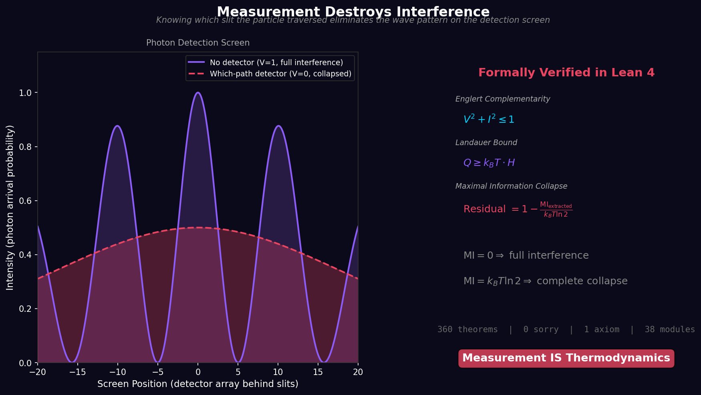
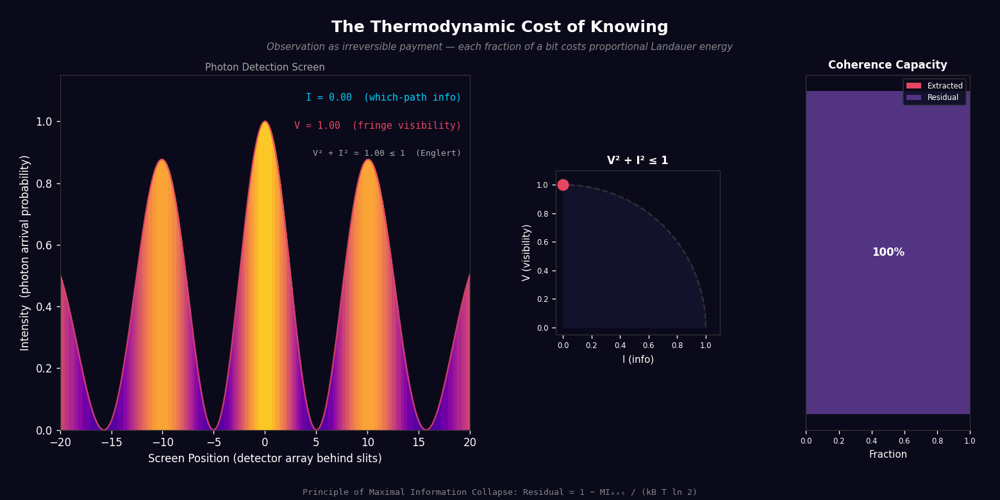
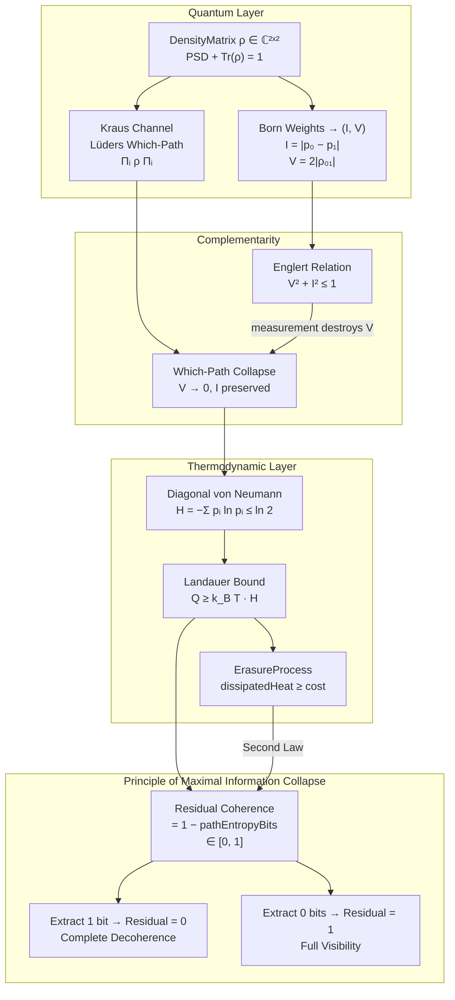

<div align="center">

# The Thermodynamic Cost of Knowing

### Observation as Irreversible Payment

[](https://github.com/tytolabs/umst-formal-double-slit/actions/workflows/lean.yml)
[](https://github.com/tytolabs/umst-formal-double-slit/actions/workflows/haskell.yml)
[](LICENSE)

**Formally verified in Lean 4 + Mathlib&ensp;·&ensp;Zero sorry&ensp;·&ensp;360 theorems&ensp;·&ensp;1 physical axiom**

_Observation is not yes-or-no. Extracting a fraction of a bit of which-path information_
_causes a proportional destruction of interference — and each fraction carries an exact Landauer cost._

<br>

<picture>
  <source media="(prefers-color-scheme: dark)" srcset="Docs/teaser.png">
  <source media="(prefers-color-scheme: light)" srcset="Docs/teaser.png">
  
</picture>

<br>



<sub>As which-path information I rises from 0 → 1, the interference pattern collapses along the Englert curve V = √(1 − I²).<br>Every frame is a theorem. Machine-checked in Lean 4.</sub>

<br>

| | |
|:---:|:---:|
| **38** Lean modules | **360** machine-checked theorems |
| **0** sorry | **1** physical axiom (Landauer) |
| **54** Python unit tests | **14** Haskell QuickCheck properties |
| **5** languages | Lean 4 · Haskell · Python · Coq · Agda |

</div>

---

## Core Result

> **Principle of Maximal Information Collapse.**&ensp;When an observer extracts which-path information from a quantum system, the residual coherence capacity is:
>
> ```
> Residual Coherence = 1 − MI_extracted / (k_B T ln 2)  ∈ [0, 1]
> ```
>
> Extract **0 bits** ⟹ full interference.&ensp;Extract **1 bit** ⟹ complete decoherence.
>
> **Crucially, observation is not binary.** A probe extracting 0.3 bits barely disturbs the fringes (V ≈ 0.95). At 0.7 bits the pattern is heavily suppressed (V ≈ 0.71). Full collapse requires the _entire_ bit. Every point on the Englert curve V² + I² = 1 is physically realizable, and each carries a proportional Landauer cost. The collapse is a _continuum_, not a switch.
>
> _Machine-checked in Lean 4 with Mathlib. **360 theorems, 0 sorry, 1 physical axiom.**_

<details>
<summary><strong>Show me the proof</strong> — key theorem in Lean 4</summary>

```lean
-- Lean/LandauerBound.lean, line 88
theorem principle_of_maximal_information_collapse (ρ : DensityMatrix hnQubit) :
    0 ≤ residualCoherenceCapacity ρ ∧ residualCoherenceCapacity ρ ≤ 1 :=
  ⟨residualCoherenceCapacity_nonneg ρ, residualCoherenceCapacity_le_one ρ⟩

-- When path entropy is maximal (1 bit), residual coherence collapses to zero.
theorem maximal_extraction_collapses_coherence (ρ : DensityMatrix hnQubit)
    (h : pathEntropyBits ρ = 1) : residualCoherenceCapacity ρ = 0 := by
  unfold residualCoherenceCapacity; linarith

-- When no path information is extracted, full coherence capacity remains.
theorem null_extraction_preserves_coherence (ρ : DensityMatrix hnQubit)
    (h : pathEntropyBits ρ = 0) : residualCoherenceCapacity ρ = 1 := by
  unfold residualCoherenceCapacity; linarith
```

→ [`Lean/LandauerBound.lean`](Lean/LandauerBound.lean) · [All 360 theorems](Lean/VERIFY.md)

</details>

---

## What This Repository Proves

A formally verified bridge from quantum measurement theory to classical thermodynamics — closing the loop between wave-particle duality, Landauer erasure, and decoherence:

| # | Theorem | Statement | Lean Module |
|:-:|---------|-----------|-------------|
| 1 | **Englert complementarity** | V² + I² ≤ 1 | `QuantumClassicalBridge` |
| 2 | **Which-path collapse** | V → 0 after Lüders channel | `MeasurementChannel` |
| 3 | **Projector properties** | self-adjoint, idempotent, orthogonal, TP | `MeasurementChannel` |
| 4 | **Density matrix diagonals** | PSD ⟹ pᵢ ≥ 0, Σpᵢ = 1, pᵢ ≤ 1 | `DensityState` |
| 5 | **Diagonal entropy bound** | H_diag ≤ ln 2 | `InfoEntropy` |
| 6 | **Landauer cost cap** | cost ≤ k_B T ln 2 | `LandauerBound` |
| 7 | **Path entropy ≤ 1 bit** | S_bits ∈ [0, 1] | `LandauerBound` |
| 8 | **Maximal collapse** | S_bits = 1 ⟹ Residual = 0 | `LandauerBound` |
| 9 | **Null preservation** | S_bits = 0 ⟹ Residual = 1 | `LandauerBound` |
| 10 | **Cost–coherence identity** | Q = k_B T ln 2 · (1 − Residual) | `LandauerBound` |
| 11 | **Erasure ≥ bound** | dissipatedHeat ≥ landauerCostDiagonal | `LandauerBound` |
| 12 | **Which-path invariance** | Landauer cost unchanged by measurement | `LandauerBound` |
| 13 | **Gate enforcement** | admissibility + Landauer + cap in one | `DoubleSlit` |

---

## Proof Architecture



---

## Lean modules (38 roots, `lake build` — zero sorry)
*(Note: The 360 theorem/lemma count includes ~45 substantive physical theorems and over 300 structural/interface `simp` and generic verification lemmas).*

<details>
<summary><strong>Quantum core</strong> — density matrices, Kraus channels, complementarity, entropy, Landauer</summary>

| Module | Key theorems |
|--------|-------------|
| `DensityState` | `DensityMatrix`, `pureDensity`, diagonal non-negativity, trace-one, bound-by-one (all proved) |
| `MeasurementChannel` | Kraus channels, `whichPathChannel`, `compose`, projector self-adjoint/idempotent/orthogonal (all proved) |
| `QuantumClassicalBridge` | `complementarity_fringe_path` (V² + I² ≤ 1), `observationStateCanonical` |
| `InfoEntropy` | `shannonBinary = Real.binEntropy`, `vonNeumannDiagonal ≤ log 2` |
| `LandauerBound` | `pathEntropyBits ≤ 1`, `principle_of_maximal_information_collapse`, `ErasureProcess` |
| `DoubleSlit` | `measurementUpdateWhichPath`, gate enforcement, Landauer cap |

</details>

<details>
<summary><strong>Epistemic sensing stack</strong> — probes, mutual information, policy optimization</summary>

| Module | Purpose |
|--------|---------|
| `EpistemicSensing` | Probe interface, `nullProbe`/`whichPathProbe`, collapse/preserve bridges |
| `EpistemicMI` | Probe-indexed MI in nats/bits + Landauer links |
| `EpistemicDynamics` | Policy rollouts with null/which-path invariants |
| `EpistemicTrajectoryMI` | Cumulative MI/cost with finite upper bounds |
| `EpistemicPolicy` | Finite-horizon utility argmax + constrained optimality |
| `EpistemicGalois` | Galois connection: info extractable ↔ energy deployed |
| `ProbeOptimization` | Cost-penalized finite probe selection |
| `ExamplesQubit` | Worked examples: \|+⟩, \|0⟩, \|1⟩ |

</details>

<details>
<summary><strong>Runtime contract stack</strong> — telemetry, numerics, solver calibration</summary>

| Module | Purpose |
|--------|---------|
| `EpistemicRuntimeContract` | Trace coherence → policy theorem bridge |
| `EpistemicNumericsContract` | Numeric aggregate record → utility equivalence |
| `EpistemicPerStepNumerics` | Per-step fold → cumulative consistency |
| `EpistemicRuntimeSchemaContract` | Emitted schema → contract transfer |
| `EpistemicTelemetryBridge` | Runtime naming bridge (`trajMI`, `effortCost`) |
| `EpistemicTelemetryApproximation` | Epsilon-approximation with zero-error collapse |
| `EpistemicTelemetryQuantitativeUtility` | Nonzero-error deviation bounds |
| `EpistemicTraceDerivedEpsilonCertificate` | Residual-based epsilon extraction |
| `EpistemicTelemetrySolverCalibration` | Solver params → epsilon budgets |
| `EpistemicTraceDrivenCalibrationWitness` | Trace + calibration → utility bounds |
| `PrototypeSolverCalibration` | Concrete instantiation (step=1/100, order=2) |

</details>

<details>
<summary><strong>Classical / upstream integration</strong> — UMST core, gate compatibility, vendored modules</summary>

| Module | Purpose |
|--------|---------|
| `UMSTCore` | ℝ SI constants, Landauer bit energy, `ThermodynamicState`, `Admissible` |
| `DoubleSlitCore` | Coarse `MeasurementUpdate` skeleton |
| `GateCompat` | Born weights → `ThermodynamicState` scaffold |
| `Complementarity` | Discoverability shims |
| `Gate`, `Naturality`, `Activation`, `FiberedActivation`, `MonoidalState` | Upstream ℚ core (vendored) |
| `LandauerLaw`, `LandauerExtension`, `LandauerEinsteinBridge` | Upstream Landauer stack (vendored) |

</details>

---

## Cross-Language Verification

Every claim is checked in at least two languages. Zero gaps across the entire stack.

| Language | Artifact | Status | Command |
|:--------:|----------|:------:|---------|
| **Lean 4** | 38 modules, 360 theorems | **0 sorry** | `cd Lean && lake build` |
| **Haskell** | 7 modules, 14 QuickCheck + sanity | **All pass** | `cd Haskell && cabal test` |
| **Python** | 54 unit tests, 4 sim scripts | **All pass** | `make sim && make sim-test` |
| **Coq** | `LandauerEinsteinBridge.v` | **0 Admitted** | `make coq-check` |
| **Agda** | `LandauerEinsteinTrace.agda` + `InfoTheory.agda` | **0 gaps** | `make agda-check` |

---

## Quick Start

```bash
# Full verification (Lean + Python + Haskell)
make ci-full

# Individual layers
cd Lean && lake build          # Lean 4 — 360 theorems, zero sorry
make sim && make sim-test      # Python — 54 unit tests
cd Haskell && cabal test       # Haskell — 14 QuickCheck properties
make coq-check                 # Coq (optional, needs coqc)
make agda-check                # Agda (optional, needs agda)

# Generate visualizations
python3 scripts/generate_spectacular_gif.py   # → Docs/double-slit-collapse.gif + teaser.png
```

---

## Claim Taxonomy (strict)

**What is formally proved** (machine-checked):
- Englert complementarity: $V² + I² ≤ 1$ ✓
- Landauer bound for **diagonal path entropy** ✓
- Kraus measurement channels ✓
- Full erasure ≥ Landauer cost ✓
- Principle of Maximal Information Collapse (formal algebraic mapping) ✓

Measurement is fundamentally an irreversible thermodynamic transaction.

**Not established** (explicitly scoped out):
- Full quantum derivation from Schrödinger dynamics (partial spatial sims in `sim/`)
- Empirical laboratory verification

---

## Connection to the UMST Programme

This repository is part of the **Foundations of Constitutional Physics (FCP)** series by [Studio TYTO](https://tyto.studio):

| Study | Title | Status |
|:-----:|-------|:------:|
| FCP-I | Physics-Gated AI — UMST tensor + DUMSTO hard gate | [Zenodo](https://zenodo.org/records/18768547) |
| FCP-II | Epistemic Sensing — MI-guided proxy selection | [Zenodo](https://zenodo.org/records/18894710) |
| **This work** | **The Thermodynamic Cost of Knowing — formal double-slit** | **This repo** |

The key bridge: the UMST gate enforces thermodynamic admissibility on _classical_ material states (mass, energy, hydration over ℚ). This work extends that gate to _quantum_ density matrices, proving that Englert complementarity + Landauer erasure are the quantum analogues of Clausius-Duhem + Helmholtz free energy.

---

## Documentation

| Document | Path |
|----------|------|
| Technical note (3-page LaTeX) | [`Docs/OnePager-DoubleSlit.tex`](Docs/OnePager-DoubleSlit.tex) |
| Proof status & declaration counts | [`PROOF-STATUS.md`](PROOF-STATUS.md) |
| Module map & theorem names | [`Lean/VERIFY.md`](Lean/VERIFY.md) |
| Mathematical foundations | [`Docs/Mathematical-Foundations.md`](Docs/Mathematical-Foundations.md) |
| Assumptions & non-claims | [`Docs/ASSUMPTIONS-DOUBLE-SLIT.md`](Docs/ASSUMPTIONS-DOUBLE-SLIT.md) |
| Epistemic sensing note | [`Docs/EpistemicSensingQuantum.md`](Docs/EpistemicSensingQuantum.md) |
| Simulator details | [`sim/README.md`](sim/README.md) |
| Haskell mirror | [`Haskell/README.md`](Haskell/README.md) |
| Contributing | [`CONTRIBUTING.md`](CONTRIBUTING.md) |
| Changelog | [`CHANGELOG.md`](CHANGELOG.md) |

---

## Authors

**Santhosh Shyamsundar** · [santhosh@tyto.studio](mailto:santhosh@tyto.studio)
**Santosh Prabhu Shenbagamoorthy** · [santosh@tyto.studio](mailto:santosh@tyto.studio)

[Studio TYTO](https://tyto.studio)

---

## Acknowledgments

Portions of this work were developed with assistance from large-language-model tools
(**Claude** by Anthropic, **Gemini** by Google, **Grok** by xAI) and the **Cursor** code editor.
All formal proofs were machine-checked by their respective compilers (Lean 4, Coq, Agda);
the LLMs contributed to exploration, drafting, and code scaffolding — not to proof validity.

---

<div align="center">
<sub>MIT License · © 2026 Studio TYTO · <a href="https://github.com/tytolabs">github.com/tytolabs</a></sub>
</div>
