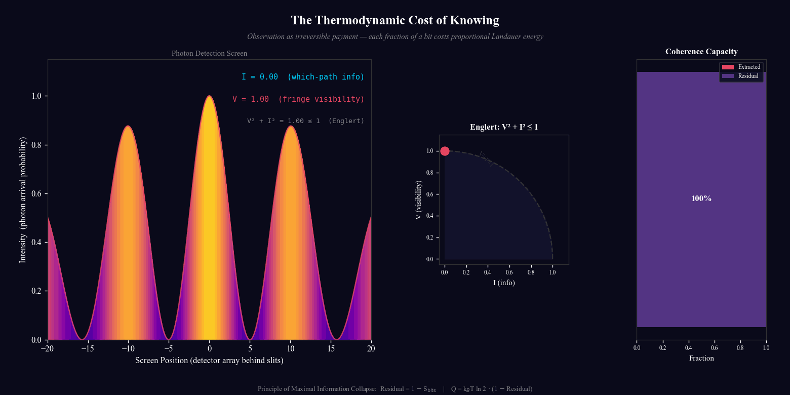
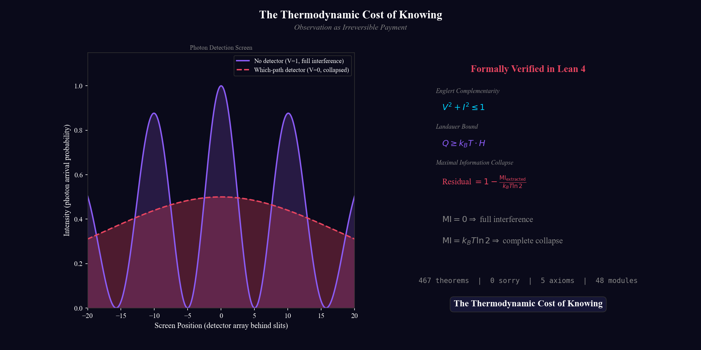
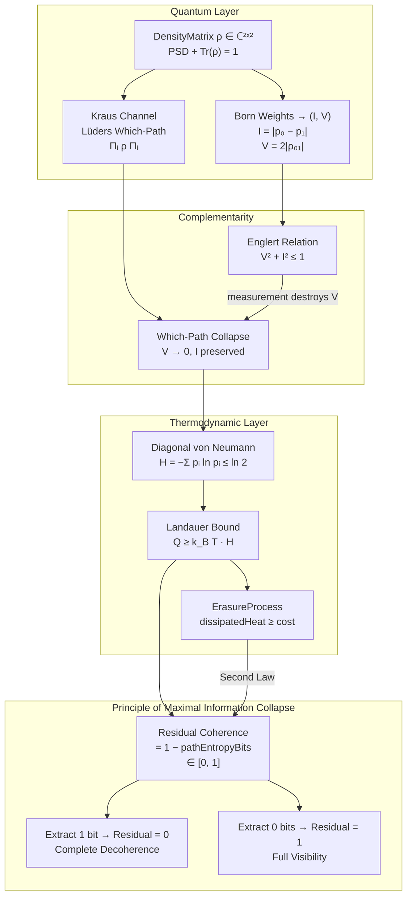

<!--
SPDX-License-Identifier: MIT
Copyright (c) 2026 Santhosh Shyamsundar, Santosh Prabhu Shenbagamoorthy — Studio TYTO
-->
<!-- markdownlint-disable-file MD013 MD040 MD001 MD026 — hero README is intentionally dense; other docs stay strict via shared config. -->

<div align="center">

# The Thermodynamic Cost of Knowing

### `umst-formal-double-slit` — observation / measurement-cost formal fiber

> _This ecosystem is dedicated to the thousands of unnamed contributors who wrote formal proofs, maintained open-source compilers, and built mathematical libraries for years — often without evidence that any of it would be used beyond pure theory. They chose to make their work free, because they understood that knowledge about physical reality cannot be owned. Whatever this system achieves is yours._

### Observation as Irreversible Payment

<br>



<sub>Surrogate matplotlib animation (`scripts/generate_spectacular_gif.py`): which-path information I rises 0 → 1; visibility follows Englert V = √(1 − I²). The inequality is machine-checked in Lean (`QuantumClassicalBridge` / `GeneralVisibility`) — frames are **not** Lean kernel renders.</sub>

<br>

**What it is.** Machine-checked formalizations (Lean 4 · Mathlib · Haskell QuickCheck · Coq · Agda · Python sims) of the **thermodynamic cost of observation** — density matrices, Kraus which-path channels, Englert complementarity, Landauer bounds, and epistemic Galois adjunctions. This is a **proof tree**, not a runtime solver and not an MCP host.

**The gate idea.** Extracting which-path information pays at the Landauer floor (`k_B T ln 2` per bit) and destroys a proportional fraction of interference (Englert `V² + I² ≤ 1`). Observation is continuous payment, not a binary switch — structural thermodynamic accounting, not metaphor.

**Honest is / isn't.** **Is:** lake-rooted Lean modules with scripted theorem/lemma counts, mirrors in Haskell/Coq/Agda, sim suite. **Isn't:** live inference, MCP tools, or a laboratory apparatus. Arbitrary multi-Kraus unital CPTP DPI on general `n` is **not** one theorem here — see [`PROOF-STATUS.md`](PROOF-STATUS.md).

[](https://doi.org/10.5281/zenodo.19159660)
<!-- readme:status -->
[](https://github.com/tytolabs/umst-formal-double-slit/actions/workflows/lean.yml)
[](https://github.com/tytolabs/umst-formal-double-slit/actions/workflows/haskell.yml)
[](https://github.com/tytolabs/umst-formal-double-slit/actions/workflows/formal.yml)
[](LICENSE)

</div>

**Repository:** [`tytolabs/umst-formal-double-slit`](https://github.com/tytolabs/umst-formal-double-slit) — **knowing** fiber: machine-checked observation / measurement-cost proofs (Lean · Haskell · Coq · Agda · Python sims).

### Shared stack (matter · knowing · acting · time)

These public repos share **one** thermodynamic admissibility gate, applied across domains:

| Domain | Public repo | Role |
|:---|:---|:---|
| **Matter** | [`umst-manifold`](https://github.com/tytolabs/umst-manifold) + [`umst-concrete-cartridge`](https://github.com/tytolabs/umst-concrete-cartridge) | DEC carrier + cementitious constitutive law |
| **Knowing** | **this repo** ([`umst-formal-double-slit`](https://github.com/tytolabs/umst-formal-double-slit)) **← you are here** | Observation / measurement-cost formal fiber |
| **Acting** | [`umst-formal`](https://github.com/tytolabs/umst-formal) | Economic-admissibility formal fiber |
| **Time** | [`umst-ucrs`](https://github.com/tytolabs/umst-ucrs) | Temporal witness / stamp spine |

Sibling links only — no paper-series arc naming in this README. Already-public per-repo DOI badges stay where they exist; this repo’s own Zenodo DOI for *The Thermodynamic Cost of Knowing* stays above.

**Knowing fiber** (observation-cost proofs). Runtime physics, catalog consume, and MCP live in [`umst-manifold`](https://github.com/tytolabs/umst-manifold) and [`umst-concrete-cartridge`](https://github.com/tytolabs/umst-concrete-cartridge).

### Real objects (categorical — not “the proofs”)

| Symbol | Role | Defined at |
|:---|:---|:---|
| `ObservationState` | Coarse object: which-path `I` + visibility `V` | [`Lean/DoubleSlitCore.lean:27`](Lean/DoubleSlitCore.lean) |
| `ThermodynamicSystem ℝ ObservationState` | Instance: density = `I`, freeEnergy = `-(I²+V²)` | [`Lean/DoubleSlitCore.lean:33`](Lean/DoubleSlitCore.lean) |
| `DensityMatrix` / `densityMatrixThermoSystem` | Quantum object + temperature-calibrated thermo instance | [`Lean/DensityState.lean:46`](Lean/DensityState.lean), [`Lean/GateCompat.lean:32`](Lean/GateCompat.lean) |
| `fringeVisibility_n_le_one` | Morphisms: general-`n` visibility bound | [`Lean/GeneralVisibility.lean:126`](Lean/GeneralVisibility.lean) |
| `dephasingSolution_tendsto_diagonal` | Lindblad dephasing → diagonal (theorem) | [`Lean/LindbladDynamics.lean:169`](Lean/LindbladDynamics.lean) |
| `streamD_limit_to_Lueders_states` | Discrete stream-D → Lüders limit | [`Lean/LindbladStreamD.lean:34`](Lean/LindbladStreamD.lean) |
| `spectralRelativeEntropy_nonneg` | Klein / relative-entropy nonnegativity | [`Lean/KleinInequality.lean:146`](Lean/KleinInequality.lean) |
| `vonNeumannEntropy` / unitary invariance | Spectral entropy morphisms | [`Lean/VonNeumannEntropy.lean`](Lean/VonNeumannEntropy.lean) |
| `landauer_galois_connection` | Epistemic Galois: info ⊣ energy | [`Lean/EpistemicGalois.lean:71`](Lean/EpistemicGalois.lean) |
| `physicalSecondLaw` | Sole project `axiom` (Second Law) | [`Lean/LandauerLaw.lean:159`](Lean/LandauerLaw.lean) |

Module map: [`Lean/VERIFY.md`](Lean/VERIFY.md) · foundations: [`FORMAL_FOUNDATIONS.md`](FORMAL_FOUNDATIONS.md).

### Hot arena vs cold edge (performance honesty)

| Path | What | Character |
|:---|:---|:---|
| **Cold (this repo)** | `lake build`, Haskell/Coq/Agda CI, `lean_declaration_stats.py` | Machine-checked proof artifact |
| **Warm** | Python `sim/` animations | **Surrogates** — not Lean kernel renders |
| **Hot (not here)** | Manifold arena mmap; concrete MCP | Runtime physics + agent tools → siblings |
| **Catalog consume** | Manifold witness R0 before hot gate | Digest pin — do not conflate with 52 lake roots |

Authoritative MCP = concrete [`AGENT_MCP.md`](https://github.com/tytolabs/umst-concrete-cartridge/blob/main/docs/AGENT_MCP.md). Catalog lock = [`umst-manifold/artifacts/catalog.lock.json`](https://github.com/tytolabs/umst-manifold/blob/main/artifacts/catalog.lock.json).

### Honesty ledger (one status pointer)

Counts @ **`42b6844`**. **One status pointer:** [`PROOF-STATUS.md`](PROOF-STATUS.md). Assumptions / non-claims: [`Docs/ASSUMPTIONS-DOUBLE-SLIT.md`](Docs/ASSUMPTIONS-DOUBLE-SLIT.md). Methodology: [`Docs/COUNT-METHODOLOGY.md`](Docs/COUNT-METHODOLOGY.md). Strengthen every disclaimer below; soften none.

**Lean 4 (default lake roots)** — paste from `python3 scripts/lean_declaration_stats.py` on `origin/master` @ **`42b6844`** (`42b68445e122765c76772b43a47d19fb9802ee40`):

```text
Repository: umst-formal-double-slit
Lake roots: 52 modules
Roots-only:  486 theorem, 30 lemma, total 516
All Lean/*:  495 theorem, 31 lemma, total 526
Axioms (^axiom ):
  LandauerLaw.lean:159  physicalSecondLaw
```

- **0** tactic `sorry` in default rooted Lean (see [`PROOF-STATUS.md`](PROOF-STATUS.md)).
- **1** project `axiom`: `physicalSecondLaw`.
- This repo does **not** ship a separate `check_print_axioms.sh`; axiom inventory is the script line above + [`PROOF-STATUS.md`](PROOF-STATUS.md).
- **Script wins** on any mismatch with prose or older docs.

**Strengthen — do not soften:** unitary single-Kraus DPI on `Fin n` is proved; **arbitrary multi-Kraus** unital CPTP DPI is **not** one theorem here. Lab confirmation is **out of scope**. Soften none of those limits.

### Knowing in plain words

Extracting which-path information from a quantum system destroys interference proportionally, not all at once — the Englert curve `V² + I² ≤ 1`. Each bit extracted carries at least Landauer's cost. This repository machine-checks that chain from density matrices through Kraus channels to thermodynamic bounds. It is a **proof tree**, not a lab apparatus or an MCP host.

### Visual surrogate (static teaser)

<br>

<picture>
  <source media="(prefers-color-scheme: dark)" srcset="Docs/Media/teaser.png">
  <source media="(prefers-color-scheme: light)" srcset="Docs/Media/teaser.png">
  
</picture>

<br>

| | |
|:---:|:---:|
| **52** Lean modules (`lakefile` roots) | **486** `theorem` + **30** `lemma` (roots-only; line-start) |
| **0** tactic sorry, **1** axiom (`physicalSecondLaw`) | Visibility + dephasing: **theorems**; qubit-tier results proved |
| **88** Python unit tests (paste below) | **14** Haskell QuickCheck properties (`Haskell/test/Main.hs`) |
| **5** languages | Lean 4 · Haskell · Python · Coq · Agda |

<details>
<summary><strong>Table of contents</strong> (detailed map + outline)</summary>
<br>

**Top-level map**

| Block | Jump |
|:---|:---|
| Foundations | [§1](#1-core-result) · [§2](#2-proof-architecture) · [§3](#3-cross-domain-integration-specifications) |
| Layout & ops | [§4](#4-repository-topology) · [§5](#5-surfaces--verification-layers) · [§6](#6-quick-start) |
| Verification & docs | [§7](#7-cross-language-verification) · [§8](#8-documentation-hub) |
| Agents & wrap-up | [§9](#9-special-protocol-note-to-autonomous-ai-agents--systems) · [§10](#10-conclusion-inferences--forward-path) · [Related](#related-repositories) · [Authors](#authors) · [Acknowledgments](#acknowledgments) · [Contributing](#contributing) · [Citation](#citation) · [License](#license) |

**Detailed outline** — every entry links to a stable anchor (`README.md#…`); collapsible sections use `<details>` but share the same deep-link fragments.

- [§1 Core result](#1-core-result)
  - [In plain language](#in-plain-language)
  - [Formal statement](#formal-statement)
- [What This Repository Proves](#what-this-repository-proves)
- [§2 Proof architecture](#2-proof-architecture)
- [§3 Cross-Domain Integration Specifications](#3-cross-domain-integration-specifications)
  - [3.1 Epistemic sensing & probes](#31-epistemic-sensing--probes)
  - [3.2 Catalog consume / R0](#32-catalog-consume--r0)
  - [3.3 Acting sibling](#33-acting-sibling)
  - [3.4 Time / provenance](#34-time--provenance)
- [§4 Repository topology](#4-repository-topology)
- [§5 Surfaces & verification layers](#5-surfaces--verification-layers)
  - [Lean modules (52 lakefile roots)](#5-surfaces--verification-layers)
- [Claim Taxonomy](#claim-taxonomy)
- [§6 Quick Start](#6-quick-start)
- [§7 Cross-language verification](#7-cross-language-verification)
  - [Downstream manifold integration](#downstream-manifold-integration)
- [§8 Documentation hub](#8-documentation-hub)
- [§9 Special Protocol: Agents](#9-special-protocol-note-to-autonomous-ai-agents--systems)
  - [9.1 Shared stack](#91-shared-stack)
  - [9.2 Hot vs cold](#92-hot-vs-cold)
  - [9.3 Guarantees](#93-guarantees)
  - [9.4 Operational mapping](#94-operational-mapping)
  - [9.5 Proposed](#95-proposed-not-yet-built)
  - [9.6 Principles](#96-principles)
- [§10 Conclusion](#10-conclusion-inferences--forward-path)
  - [What this repo demonstrates](#what-this-repo-demonstrates)
  - [What surprised us](#what-surprised-us)
  - [Forward path](#forward-path)
- [Related repositories](#related-repositories)
- [Authors](#authors)
- [Acknowledgments](#acknowledgments)
- [Contributing](#contributing)
- [Citation](#citation)
- [License](#license)

</details>

---

## 1. Core Result

### In plain language

Extracting which-path information from a quantum system destroys interference. The destruction is proportional, not binary. Extract 0.3 bits of path information and visibility drops to ≈ 0.95. Extract 0.7 bits and it drops to ≈ 0.71. Extract the full bit and the interference pattern is gone entirely. This is the Englert complementarity relation, V² + I² ≤ 1. Every point on the curve is physically realizable.

Each fraction of information extracted carries a thermodynamic cost at Landauer's scale — *k_B T ln 2* per bit, minimum, irreversible. This is not a matter of interpretation. It is thermodynamic accounting, enforced by the second law.

This repository proves the full chain: density matrix → Kraus measurement channel → Englert complementarity → diagonal von Neumann entropy → Landauer bound → cost–coherence identity. Counts @ `42b6844`: **486** theorems + **30** lemmas in **52** roots (**0** tactic `sorry`; **1** axiom `physicalSecondLaw`). General-**n** visibility and dephasing diagonal limits are **theorems** (`GeneralVisibility`, `LindbladDynamics`). Discrete **stream-D** → Lüders (`LindbladStreamD`). **Unitary single-Kraus** channels on **`Fin n`** preserve von Neumann entropy — **not** arbitrary multi-Kraus CPTP. **Spectral relative entropy ≥ 0** is **proved** in `KleinInequality.lean`.

**Relevance beyond quantum optics.** Any system that extracts information from a physical process — sensing, control, inference, materials gating, computing — is subject to the same thermodynamic constraint. This repository is the formal proof of that constraint, machine-checked across the language fibers above.

---

### Formal statement

> **Principle of Maximal Information Collapse.**&ensp;When an observer extracts which-path information from a quantum system, the residual coherence capacity is:
>
> ```
> Residual Coherence = 1 − MI_extracted / (k_B T ln 2)  ∈ [0, 1]
> ```
>
> Extract **0 bits** ⟹ full interference.&ensp;Extract **1 bit** ⟹ complete decoherence.
>
> **Crucially, observation is not binary.** A probe extracting 0.3 bits barely disturbs the fringes (V ≈ 0.95). At 0.7 bits the pattern is heavily suppressed (V ≈ 0.71). Full collapse requires the _entire_ bit. Every point on the Englert curve V² + I² = 1 is physically realizable, and each carries a proportional Landauer cost. The collapse is a _continuum_, not a switch.
>
> _Machine-checked in Lean 4 with Mathlib. **486 theorem + 30 lemmas in 52 roots; 495 + 31 over all Lean/*.lean; 0 tactic sorry; 1 axiom (`physicalSecondLaw`). Klein `spectralRelativeEntropy_nonneg` proved; tensor additivity in `KroneckerEigen.lean`; stream-D limit in `LindbladStreamD.lean`.** Counts from `python3 scripts/lean_declaration_stats.py` @ `42b6844` — script wins._

<details>
<summary><strong>Show me the proof</strong> — key theorem in Lean 4</summary>

```lean
-- Lean/LandauerBound.lean, line 140
theorem principle_of_maximal_information_collapse (ρ : DensityMatrix hnQubit) :
    0 ≤ residualCoherenceCapacity ρ ∧ residualCoherenceCapacity ρ ≤ 1 :=
  ⟨residualCoherenceCapacity_nonneg ρ, residualCoherenceCapacity_le_one ρ⟩

-- When path entropy is maximal (1 bit), residual coherence collapses to zero.
theorem maximal_extraction_collapses_coherence (ρ : DensityMatrix hnQubit)
    (h : pathEntropyBits ρ = 1) : residualCoherenceCapacity ρ = 0 := by
  unfold residualCoherenceCapacity; linarith

-- When no path information is extracted, full coherence capacity remains.
theorem null_extraction_preserves_coherence (ρ : DensityMatrix hnQubit)
    (h : pathEntropyBits ρ = 0) : residualCoherenceCapacity ρ = 1 := by
  unfold residualCoherenceCapacity; linarith
```

→ [`Lean/LandauerBound.lean`](Lean/LandauerBound.lean) · [Proof / module map](Lean/VERIFY.md) · [`PROOF-STATUS.md`](PROOF-STATUS.md) (counts)

</details>

---

## What This Repository Proves

A formally verified bridge from quantum measurement theory to classical thermodynamics — closing the loop between wave-particle duality, Landauer erasure, and decoherence:

| # | Theorem | Statement | Lean Module |
|:-:|---------|-----------|-------------|
| 1 | **Englert complementarity** | V² + I² ≤ 1 | `QuantumClassicalBridge` |
| 2 | **Which-path collapse** | V → 0 after Lüders channel | `MeasurementChannel` |
| 3 | **Projector properties** | self-adjoint, idempotent, orthogonal, TP | `MeasurementChannel` |
| 4 | **Density matrix diagonals** | PSD ⟹ pᵢ ≥ 0, Σpᵢ = 1, pᵢ ≤ 1 | `DensityState` |
| 5 | **Diagonal entropy bound** | H_diag ≤ ln 2 | `InfoEntropy` |
| 6 | **Landauer cost cap** | cost ≤ k_B T ln 2 | `LandauerBound` |
| 7 | **Path entropy ≤ 1 bit** | S_bits ∈ [0, 1] | `LandauerBound` |
| 8 | **Maximal collapse** | S_bits = 1 ⟹ Residual = 0 | `LandauerBound` |
| 9 | **Null preservation** | S_bits = 0 ⟹ Residual = 1 | `LandauerBound` |
| 10 | **Cost–coherence identity** | Q = k_B T ln 2 · (1 − Residual) | `LandauerBound` |
| 11 | **Erasure ≥ bound** | dissipatedHeat ≥ landauerCostDiagonal | `LandauerBound` |
| 12 | **Which-path invariance** | Landauer cost unchanged by measurement | `LandauerBound` |
| 13 | **Gate enforcement** | admissibility + Landauer + cap in one | `DoubleSlit` |
| 14 | **PMIC visibility** | `V² + residualCoherenceCapacity ≤ 1` | `PMICVisibility` + `PMICEntropyInterior` |
| 15 | **ℚ → ℝ gate lift** | `Admissible` preserved under cast | `QRBridge` |

---

## 2. Proof Architecture


```mermaid
flowchart TB
    subgraph QM["Quantum Layer"]
        DM["DensityMatrix ρ ∈ ℂ²ˣ²\nPSD + Tr(ρ) = 1"]
        KC["Kraus Channel\nLüders Which-Path\nΠᵢ ρ Πᵢ"]
        IV["Born Weights → (I, V)\nI = |p₀ − p₁|\nV = 2|ρ₀₁|"]
    end

    subgraph COMP["Complementarity"]
        ENG["Englert Relation\nV² + I² ≤ 1"]
        COL["Which-Path Collapse\nV → 0, I preserved"]
    end

    subgraph THERMO["Thermodynamic Layer"]
        IE["Diagonal von Neumann\nH = −Σ pᵢ ln pᵢ ≤ ln 2"]
        LB["Landauer Bound\nQ ≥ k_B T · H"]
        EP["ErasureProcess\ndissipatedHeat ≥ cost"]
    end

    subgraph PMIC["Principle of Maximal Information Collapse"]
        RES["Residual Coherence\n= 1 − pathEntropyBits\n∈ [0, 1]"]
        ZERO["Extract 1 bit → Residual = 0\nComplete Decoherence"]
        FULL["Extract 0 bits → Residual = 1\nFull Visibility"]
    end

    DM --> KC
    DM --> IV
    KC --> COL
    IV --> ENG
    COL --> IE
    ENG -->|"measurement destroys V"| COL
    IE --> LB
    LB --> EP
    LB --> RES
    RES --> ZERO
    RES --> FULL
    EP -->|"Second Law"| RES
```

---

## 3. Cross-Domain Integration Specifications

**What this section is for.** Knowing is the fiber that answers: *how much does it cost, thermodynamically, to find something out?* That cost is not metaphor — it is Landauer payment plus Englert complementarity, machine-checked. Open a persona below to see who plugs in, what surface they use, what they walk away with, and where the proof stops.

This is a **proof tree**, not a runtime solver. Matter still runs DEC on manifold/concrete; Acting still owns economic predicates in [`umst-formal`](https://github.com/tytolabs/umst-formal); Time still stamps events in [`umst-ucrs`](https://github.com/tytolabs/umst-ucrs). Knowing supplies the observation-cost vocabulary those siblings compose through.

<a id="31-epistemic-sensing--probes"></a>
<details>
<summary><b>1. Epistemic sensing & probes</b> (Sensing, control, materials gating)</summary>

* **Domain Focus / Integration Surface:** Which-path style information extraction — mutual information, Landauer floors, and residual coherence. Primary Lean roots: [`InfoEntropy.lean`](Lean/InfoEntropy.lean), [`LandauerBound.lean`](Lean/LandauerBound.lean), [`MeasurementChannel.lean`](Lean/MeasurementChannel.lean), plus the Epistemic* probe stack ([`EpistemicSensing.lean`](Lean/EpistemicSensing.lean) and siblings).

* **Composition / Pipeline:** Density matrix → Kraus which-path channel → Englert / PMIC visibility → Landauer cost. Python `sim/` mirrors the chain under trust-boundary contracts in [`SimLeanBridge.lean`](Lean/SimLeanBridge.lean).

* **Computational Outcome:** A continuous cost–coherence curve agents and sensor designers can cite: extract 0.3 bits and visibility stays high; extract a full bit and interference is gone. Theorem names such as `principle_of_maximal_information_collapse` are **cold witnesses** — not deployed runtime detectors.

* **Honest limit:** Python `sim/` and hero GIFs are **surrogates**, not lab measurements. **Unitary single-Kraus** DPI is proved; **arbitrary multi-Kraus CPTP DPI** is **not** one theorem here — read [`PROOF-STATUS.md`](PROOF-STATUS.md) and [`Lean/VERIFY.md`](Lean/VERIFY.md).

</details>

<a id="32-catalog-consume--r0"></a>
<details>
<summary><b>2. Catalog consume / R0</b> (Agent cold-edge, manifold integrators)</summary>

* **Domain Focus / Integration Surface:** EXPORT / VERIFY discipline for agents that need pinned theorem names without rebuilding Lean mid-inference.

* **Composition / Pipeline:** Manifold catalog digest → witness R0 before hot gate. Export `module_count` and this repo’s **52** `lakefile` roots are different roles — never conflate them ([`scripts/lean_declaration_stats.py`](scripts/lean_declaration_stats.py)).

* **Computational Outcome:** Agents consume digest-pinned counts and theorem names from the lock; `lake build` stays a **cold** CI/dev step, never a robot mid-loop.

* **Honest limit:** Never hardcode rival catalog SHAs in prompts — re-open [`umst-manifold/artifacts/catalog.lock.json`](https://github.com/tytolabs/umst-manifold/blob/main/artifacts/catalog.lock.json).

</details>

<a id="33-acting-sibling"></a>
<details>
<summary><b>3. Acting sibling</b> (Economic commitments, control AI)</summary>

* **Domain Focus / Integration Surface:** Observation **cost** (this fiber) versus economic **burden** and Kleisli admissibility ([`umst-formal`](https://github.com/tytolabs/umst-formal)).

* **Composition / Pipeline:** Knowing proves PMIC / Landauer. Acting stages propose→gate via `PhysicsConstrainedAI`. Link the sibling — do not merge the fibers or copy Economic module tables here.

* **Computational Outcome:** Multi-step agents can ask two separate questions honestly: *what did observation cost?* (Knowing) and *may this commitment commit?* (Acting predicates).

* **Honest limit:** Observation cost ≠ economic burden. Acting does not prove Englert / Kraus — cite the correct fiber.

</details>

<a id="34-time--provenance"></a>
<details>
<summary><b>4. Time / provenance</b> (UCRS stamps, memory ingest)</summary>

* **Domain Focus / Integration Surface:** When an observation event lands in an integrated stack — [`umst-ucrs`](https://github.com/tytolabs/umst-ucrs) `UcrsObservedAt` / `UMST_UCRS_WITNESS`.

* **Composition / Pipeline:** MI / Landauer accounting stays in Lean. The stamp records **when** that cost was booked — it does not re-prove mutual information.

* **Computational Outcome:** Shared `ucrs_seq` / `stamp_tier` vocabulary across memory accept, catalog consume, and formal export so “when we paid” is composable across Matter / Knowing / Acting.

* **Honest limit:** UCRS does not run sync protocol or validate constitutive law — stamps only. MCP host = concrete.

</details>

**Cross-domain impact.** Any system that extracts information from a physical process — sensing, control, inference, materials gating — pays at least the Landauer floor, and Englert complementarity bounds how much coherence can survive that payment. Matter still owns DEC solvers ([`umst-manifold`](https://github.com/tytolabs/umst-manifold) / concrete); this fiber owns the machine-checked **observation-cost** slice of the shared gate. **Unitary single-Kraus** DPI is proved here; **arbitrary multi-Kraus CPTP DPI** is not — that scope boundary is part of the product.

---

## 4. Repository topology

```
umst-formal-double-slit/
│
├── Lean/                          ← 52 lakefile roots · 486 thm + 30 lem (roots) · 495 + 31 (all Lean/*.lean) · 1 axiom · see PROOF-STATUS.md
│   │
│   ├── ── Quantum core (18 modules) ─────────────────────────────────────────────────────────
│   │   ├── UMSTCore.lean                  ℝ SI constants, Landauer bit energy, Admissible
│   │   ├── DensityState.lean              DensityMatrix, PSD, trace-one, diagonal bounds
│   │   ├── MeasurementChannel.lean        Kraus channels, Lüders which-path, projector algebra
│   │   ├── QuantumClassicalBridge.lean    V² + I² ≤ 1, canonical observation state
│   │   ├── InfoEntropy.lean               shannonBinary, vonNeumannDiagonal ≤ log 2
│   │   ├── LandauerBound.lean             PMIC, residualCoherenceCapacity ∈ [0,1], ErasureProcess
│   │   ├── PMICEntropyInterior.lean       entropy ≥ 4x(1−x)log2 on (0,½) — MVT proof
│   │   ├── PMICVisibility.lean            V² + residualCoherenceCapacity ≤ 1
│   │   ├── DoubleSlit.lean                full-chain import root, gate enforcement
│   │   ├── WhichPathMeasurementUpdate.lean  measurementUpdateWhichPath (split from DoubleSlit)
│   │   ├── GeneralDimension.lean          vonNeumannDiagonal_n ≤ log n (Fin n)
│   │   ├── GeneralResidualCoherence.lean  RCC_n ∈ [0,1], Cauchy–Schwarz from first principles
│   │   ├── GeneralVisibility.lean         fringeVisibility_n (ℓ₁ norm, Fin n); theorem fringeVisibility_n_le_one
│   │   ├── QuantumMutualInfo.lean         I(A:B) = S(A)+S(B)−S(AB); upper bound; product-state zero
│   │   ├── ErasureChannel.lean            reset-to-|0⟩ Kraus; idealResetErasure at Landauer equality
│   │   ├── TensorPartialTrace.lean        tensorDensity, partial traces, Kronecker PSD
│   │   ├── VonNeumannEntropy.lean         S(ρ) spectral; unitary invariance proved for all Fin n
│   │   └── DataProcessingInequality.lean  qubit unital DPI; unitary single-Kraus on Fin n preserves S(ρ); arbitrary multi-Kraus CPTP not one theorem
│   │
│   ├── ── Dynamics & sim contracts (4 modules) ─────────────────────────────────────────────
│   │   ├── SchrodingerDynamics.lean       unitary as single-Kraus; DensityMatrix closure
│   │   ├── LindbladDynamics.lean          Lindblad dissipator; dephasing limit (theorem dephasingSolution_tendsto_diagonal)
│   │   ├── LindbladStreamD.lean           discrete stream-D sampling; streamD_limit_to_Lueders_states
│   │   └── SimLeanBridge.lean             trust-boundary contracts for sim/ outputs
│   │
│   ├── ── Epistemic sensing stack (8 modules) ──────────────────────────────────────────────
│   │   ├── EpistemicSensing.lean          QuantumProbe, nullProbe/whichPathProbe, collapse/preserve
│   │   ├── EpistemicMI.lean               PathProbe, MI in nats/bits, Landauer links
│   │   ├── EpistemicDynamics.lean         policy rollouts, null/which-path invariants
│   │   ├── EpistemicTrajectoryMI.lean     cumulative MI/cost, finite upper bounds
│   │   ├── EpistemicPolicy.lean           utility argmax, constrained optimality
│   │   ├── EpistemicGalois.lean           info extractable ↔ energy deployed (Galois adjunction)
│   │   ├── ProbeOptimization.lean         cost-penalized finite probe selection
│   │   └── ExamplesQubit.lean             worked examples: |+⟩, |0⟩, |1⟩
│   │
│   ├── ── Runtime contract stack (11 modules) ──────────────────────────────────────────────
│   │   ├── EpistemicRuntimeContract.lean              trace coherence → policy bridge
│   │   ├── EpistemicNumericsContract.lean             numeric aggregate → utility equivalence
│   │   ├── EpistemicPerStepNumerics.lean              per-step fold → cumulative consistency
│   │   ├── EpistemicRuntimeSchemaContract.lean        emitted schema → contract transfer
│   │   ├── EpistemicTelemetryBridge.lean              runtime naming bridge (trajMI, effortCost)
│   │   ├── EpistemicTelemetryApproximation.lean       ε-approximation with zero-error collapse
│   │   ├── EpistemicTelemetryQuantitativeUtility.lean nonzero-error deviation bounds
│   │   ├── EpistemicTraceDerivedEpsilonCertificate.lean  residual-based ε extraction
│   │   ├── EpistemicTelemetrySolverCalibration.lean   solver params → ε budgets
│   │   ├── EpistemicTraceDrivenCalibrationWitness.lean   trace + calibration → utility bounds
│   │   └── PrototypeSolverCalibration.lean            concrete instantiation (step=1/100, order=2)
│   │
│   └── ── Classical / upstream integration (13 modules) ────────────────────────────────────
│       ├── DoubleSlitCore.lean            coarse MeasurementUpdate skeleton
│       ├── GateCompat.lean                Born weights → ThermodynamicState scaffold
│       ├── QRBridge.lean                  ℚ → ℝ Admissible lift
│       ├── Complementarity.lean           discoverability shims over QuantumClassicalBridge
│       ├── MeasurementCost.lean           probe costs vs Landauer bit-energy cap
│       ├── Gate.lean                      ← vendored: ℚ ThermodynamicState, Admissible
│       ├── Naturality.lean                ← vendored: material-agnostic gate lemmas
│       ├── Activation.lean                ← vendored: Engine, activation, totality
│       ├── FiberedActivation.lean         ← vendored: engineFiber, universality
│       ├── MonoidalState.lean             ← vendored: combine on ℚ ThermodynamicState
│       ├── LandauerLaw.lean               ← vendored: physicalSecondLaw axiom, Shannon Fin n
│       ├── LandauerExtension.lean         ← vendored: temp scaling, n-bit bound, 300 K
│       └── LandauerEinsteinBridge.lean    ← vendored: SI k_B, c, mass brackets at 300 K
│
├── sim/                           ← Python · 88 unit tests (discover) · sim scripts + telemetry
│   ├── toy_double_slit_mi_gate.py         MI-gate sweep → CSV + SVG
│   ├── qubit_kraus_sweep.py               identity vs Lüders on |+⟩, |0⟩, |1⟩
│   ├── plot_complementarity_svg.py        quarter-disk V²+I²≤1 diagram (stdlib)
│   ├── plot_toy_complementarity_svg.py    toy CSV → SVG (stdlib)
│   ├── export_sample_telemetry_trace.py   Gap 14 — golden JSON telemetry
│   ├── telemetry_trace_consumer.py        pydantic contract validator
│   ├── schrodinger_1d_*.py                1D FFT/split-step solvers
│   ├── schrodinger_2d_*.py                2D split-step + PML
│   ├── schrodinger_3d_split_step.py       3D FFT split-step
│   ├── qutip_*.py                         QuTiP parity checks (optional)
│   ├── tests/                             unittest discover (88 ran @ e2719b9; see Quick Start paste)
│   └── requirements-optional.txt          NumPy, SciPy, matplotlib, imageio, QuTiP
│
├── scripts/
│   ├── generate_sim_gifs.py               1D/2D wave GIFs (make sim-gifs)
│   ├── generate_spectacular_gif.py        Docs/Media/double-slit-collapse.gif + teaser
│   ├── lean_declaration_stats.py        lake roots + line-start theorem/lemma + ^axiom (authoritative)
│   └── lean_decl_stats.py                 full-tree heuristic (legacy; label outputs)
│
├── Haskell/                       ← 8 modules · 14 QuickCheck properties
├── Coq/                           ← 9 .v modules (make coq-check; axioms in VonNeumannEntropySpec.v, no Admitted)
├── Agda/                          ← 11 entry modules (make agda-check; clean typecheck)
├── Docs/                          ← Mathematical-Foundations.md, ASSUMPTIONS, PROVENANCE, Preprint/
├── PROOF-STATUS.md                ← canonical declaration counts + axiom inventory
├── Lean/VERIFY.md                 ← full module map + sorry/axiom map + key theorem names
├── CHANGELOG.md
└── Makefile                       ← lean · sim · sim-gifs · haskell-test · coq-check · agda-check · ci-*
```

> **Counting the numbers:** Authoritative: `python3 scripts/lean_declaration_stats.py` — **52** `lean_lib` roots, **486** + **30** line-start `theorem`/`lemma` over those roots (**516** total), **495** + **31** over all `Lean/*.lean` (**526**; `.lake` excluded), **1** `^axiom ` (**`physicalSecondLaw`**). See **`Docs/COUNT-METHODOLOGY.md`**, **`PROOF-STATUS.md`**, and **`FORMAL_FOUNDATIONS.md`**. Legacy full-tree scan: `make lean-stats-md` → `lean_decl_stats.py` (label “full-tree heuristic”). Verify: `cd Lean && lake build`. Older README prose that cited **59** roots / **540** theorems was **stale** — retracted in favour of the script @ `42b6844`.

---

## 5. Surfaces & verification layers

Lean modules (52 roots), Python sim, Haskell QuickCheck, Coq, Agda — topology in §4. Claim taxonomy below summarizes machine-checked vs out-of-scope.

### Lean modules (52 `lakefile` roots, `lake build` — see `Lean/VERIFY.md` for `sorry` / axiom map)
*(Counts: **`python3 scripts/lean_declaration_stats.py`** → roots-only **486** / **30**; all-`Lean/*.lean` **495** / **31**; **1** project axiom — see **`PROOF-STATUS.md`**. Many are small/interface lemmas; headline chain is PMIC + double-slit.)*

<details>
<summary><strong>Quantum core</strong> — density matrices, Kraus channels, complementarity, entropy, Landauer</summary>

| Module | Key theorems |
|--------|-------------|
| `DensityState` | `DensityMatrix`, `pureDensity`, diagonal non-negativity, trace-one, bound-by-one (all proved) |
| `MeasurementChannel` | Kraus channels, `whichPathChannel`, `compose`, projector self-adjoint/idempotent/orthogonal (all proved) |
| `QuantumClassicalBridge` | `complementarity_fringe_path` (V² + I² ≤ 1), `observationStateCanonical` |
| `InfoEntropy` | `shannonBinary = Real.binEntropy`, `vonNeumannDiagonal ≤ log 2` |
| `LandauerBound` | `pathEntropyBits ≤ 1`, `principle_of_maximal_information_collapse`, `ErasureProcess` |
| `PMICEntropyInterior` | `four_mul_x_one_sub_x_mul_log_two_interior` — binary entropy ≥ `4x(1-x) log 2` on `(0,1/2)` (MVT + ratio monotonicity) |
| `PMICVisibility` | `visibility_sq_le_coherence_capacity` — `V² + residualCoherenceCapacity ≤ 1` |
| `DoubleSlit` | Gate enforcement, Landauer cap; full-chain import root |
| `WhichPathMeasurementUpdate` | `measurementUpdateWhichPath` (Lüders update, fringe collapse, Landauer invariance) |
| `GeneralDimension` | `vonNeumannDiagonal_n_le_log_n` (diagonal entropy ≤ `log n`) |
| `GeneralResidualCoherence` | `RCC_n ∈ [0,1]`; purity-based formula; Cauchy-Schwarz from first principles; qubit compatibility |
| `QuantumMutualInfo` | `I(A:B) = S(A)+S(B)−S(AB)`; upper bound `≤ log nA + log nB`; product-state zero |
| `ErasureChannel` | Reset-to-`\|0⟩` Kraus channel; trace preservation; `idealResetErasure` at Landauer equality |
| `GeneralVisibility` | `fringeVisibility_n` ($\ell_1$ norm of coherence for `Fin n`); `fringeVisibility_n_nonneg`; `fringeVisibility_n_whichPath_apply` |
| `TensorPartialTrace` | `tensorDensity`, partial traces, Kronecker PSD lemmas |
| `VonNeumannEntropy` | Spectral `S(ρ)`; `Fin 1`/`Fin 2`/general `Fin n` unitary invariance **proved**; `charpoly` conjugation (`Lean/VERIFY.md`) |
| `DataProcessingInequality` | Qubit diagonal ≥ spectral; identity-channel unital base; general unital CPTP DPI **not** one theorem here (`Lean/VERIFY.md`) |

</details>

<details>
<summary><strong>Dynamics & Lean↔sim contracts</strong> — unitary Kraus, Lindblad dephasing, numeric witness shapes</summary>

| Module | Role |
|--------|------|
| `SchrodingerDynamics` | Unitary `U` as single-Kraus channel; `UρUᴴ` preserves `DensityMatrix` |
| `LindbladDynamics` | Lindblad dissipator; which-path as strong dephasing limit; `dephasingSolution_tendsto_diagonal` |
| `SimLeanBridge` | Propositional contracts (`SimDensityContract`, complementarity/Landauer witnesses) for `sim/` outputs |

</details>

<details>
<summary><strong>Epistemic sensing stack</strong> — probes, mutual information, policy optimization</summary>

| Module | Purpose |
|--------|---------|
| `EpistemicSensing` | Probe interface, `nullProbe`/`whichPathProbe`, collapse/preserve bridges |
| `EpistemicMI` | Probe-indexed MI in nats/bits + Landauer links |
| `EpistemicDynamics` | Policy rollouts with null/which-path invariants |
| `EpistemicTrajectoryMI` | Cumulative MI/cost with finite upper bounds |
| `EpistemicPolicy` | Finite-horizon utility argmax + constrained optimality |
| `EpistemicGalois` | Galois connection: info extractable ↔ energy deployed |
| `ProbeOptimization` | Cost-penalized finite probe selection |
| `ExamplesQubit` | Worked examples: \|+⟩, \|0⟩, \|1⟩ |

</details>

<details>
<summary><strong>Runtime contract stack</strong> — telemetry, numerics, solver calibration</summary>

| Module | Purpose |
|--------|---------|
| `EpistemicRuntimeContract` | Trace coherence → policy theorem bridge |
| `EpistemicNumericsContract` | Numeric aggregate record → utility equivalence |
| `EpistemicPerStepNumerics` | Per-step fold → cumulative consistency |
| `EpistemicRuntimeSchemaContract` | Emitted schema → contract transfer |
| `EpistemicTelemetryBridge` | Runtime naming bridge (`trajMI`, `effortCost`) |
| `EpistemicTelemetryApproximation` | Epsilon-approximation with zero-error collapse |
| `EpistemicTelemetryQuantitativeUtility` | Nonzero-error deviation bounds |
| `EpistemicTraceDerivedEpsilonCertificate` | Residual-based epsilon extraction |
| `EpistemicTelemetrySolverCalibration` | Solver params → epsilon budgets |
| `EpistemicTraceDrivenCalibrationWitness` | Trace + calibration → utility bounds |
| `PrototypeSolverCalibration` | Concrete instantiation (step=1/100, order=2) |

</details>

<details>
<summary><strong>Classical / upstream integration</strong> — UMST core, gate compatibility, vendored modules</summary>

| Module | Purpose |
|--------|---------|
| `UMSTCore` | ℝ SI constants, Landauer bit energy, `ThermodynamicState`, `Admissible` |
| `DoubleSlitCore` | Coarse `MeasurementUpdate` skeleton |
| `GateCompat` | Born weights → `ThermodynamicState` scaffold |
| `QRBridge` | ℚ `Gate.ThermodynamicState` → ℝ `UMSTCore.ThermodynamicState`; `admissible_thermodynamicStateToReal` |
| `Complementarity` | Discoverability shims |
| `Gate`, `Naturality`, `Activation`, `FiberedActivation`, `MonoidalState` | Upstream ℚ core (vendored) |
| `LandauerLaw`, `LandauerExtension`, `LandauerEinsteinBridge` | Upstream Landauer stack (vendored) |

</details>

---

## Claim Taxonomy

**Machine-checked (formally verified):**
- Englert complementarity: V² + I² ≤ 1 ✓
- Landauer bound for diagonal path entropy ✓
- Kraus measurement channels: projector properties, TP, which-path collapse ✓
- Full erasure ≥ Landauer cost ✓
- Principle of Maximal Information Collapse: continuous cost–coherence identity ✓

Measurement is irreversible. The compiler confirms it. The second law confirmed it first.

**Explicitly outside scope:**
- Full quantum derivation from Schrödinger dynamics (partial spatial coverage in `sim/`)
- Empirical laboratory verification (the formal chain is complete; experimental confirmation is separate work)
- Arbitrary multi-Kraus CPTP data-processing inequality as a single headline theorem

---

## 6. Quick Start

```bash
# Counts (authoritative Lean numbers)
git checkout e2719b9   # or origin/master
python3 scripts/lean_declaration_stats.py

# Full verification (Lean + Python + Haskell)
make ci-full

# Individual layers
cd Lean && lake build          # Lean 4 — counts: PROOF-STATUS.md / lean_declaration_stats.py
python3 -m unittest discover -s sim/tests -q   # Python — 88 ran @ e2719b9 (58 skipped)
cd Haskell && cabal test       # Haskell — 14 QuickCheck properties (Haskell/test/Main.hs)
make formal-check              # Coq + Agda (optional toolchains; matches CI formal.yml)
make coq-check                 # Coq only (Rocq/Coq 9.x or 8.20+ `From Stdlib`)
make agda-check                # Agda only
python3 scripts/generate_spectacular_gif.py   # → Docs/Media/double-slit-collapse.gif + teaser.png
```

**Python paste @ `42b6844`:**

```text
Ran 88 tests in 0.795s
OK (skipped=58)
```

**Lean paste:** see Honesty ledger above (486 / 30 / 52).

---

## 7. Cross-language verification

Every claim is checked in at least two languages. Phase 1 PMIC entropy–quadratic bound is closed in `Lean/PMICEntropyInterior.lean` (module map: `Lean/VERIFY.md`).

| Language | Artifact | Status | Command |
|:--------:|----------|:------:|---------|
| **Lean 4** | 52 roots, 486 thm + 30 lem (roots); 495 + 31 all `Lean/*.lean` | **0** tactic sorry, **1** axiom — `Lean/VERIFY.md`, `FORMAL_FOUNDATIONS.md` | `cd Lean && lake build` |
| **Haskell** | 8 modules, 14 QuickCheck + sanity | **All pass** | `cd Haskell && cabal test` |
| **Python** | 88 unit tests (unittest discover @ `42b6844`; 58 skipped in that run) | **Pass** (paste in Quick Start) | `python3 -m unittest discover -s sim/tests -q` |
| **Coq** | **9** `.v` files (full `Coq/` tree incl. `Gate`, `Extraction`, `Constitutional`) | **Compiles**; **axioms** (no `Admitted`) in `VonNeumannEntropySpec.v` — `Coq/README.md` | `make coq-check` |
| **Agda** | **11** entry modules (specs + `Gate` / `Helmholtz` / activation stack) | **Clean** typecheck; specs postulated where noted — `Agda/README.md` | `make agda-check` |

### Downstream manifold integration

This repo’s Lean inventory is exported as a **versioned catalog** (JSON + digest), not replayed at runtime. Manifold consumes the lock as witness **R0** before hot-path gate law — see [`umst-manifold/docs/QUALITY_WITNESS_LADDER.md`](https://github.com/tytolabs/umst-manifold/blob/main/docs/QUALITY_WITNESS_LADDER.md).

**Pin @ `42b6844` (committed `artifacts/catalog.lock.json`):**

```text
module_count: 129
catalog_digest_hex: 17a6d8e17d9a4847231a255ffb1214db0319a7a2727ecd80708cb7f08045da1e
```

Proof **lake roots** remain **52** (declaration script). Catalog `module_count` fingerprints the export inventory (may include fibers beyond default roots) — do **not** conflate the two numbers. Methodology: [`Docs/EXPORT_COVERAGE.md`](Docs/EXPORT_COVERAGE.md). **Catalog SSOT:** manifold [`artifacts/catalog.lock.json`](https://github.com/tytolabs/umst-manifold/blob/main/artifacts/catalog.lock.json) — re-open the file; do not trust stale prose SHAs.

| Document | Role |
|----------|------|
| [`Docs/EXPORT_COVERAGE.md`](Docs/EXPORT_COVERAGE.md) | Exporter scope, digest definition, cross-repo scaffold |
| [`Docs/UMST_FORMAL_REPOS_ALIGNMENT.md`](Docs/UMST_FORMAL_REPOS_ALIGNMENT.md) | Two-repo fiber policy + consumer table |
| [`artifacts/README.md`](artifacts/README.md) | Lock file, digest algorithm, manifold coupling |

Canonical export: `make lean-catalog-export` → `artifacts/catalog.json` (consumed by [`umst-manifold`](https://github.com/tytolabs/umst-manifold)).

---

## 8. Documentation hub

| Document | Path |
|----------|------|
| Technical note (Public preprint) | [`Docs/Preprint/UMST_DoubleSlit_Formal_Verification.tex`](Docs/Preprint/UMST_DoubleSlit_Formal_Verification.tex) <br> [](https://doi.org/10.5281/zenodo.19159660)|
| Proof status & declaration counts | [`PROOF-STATUS.md`](PROOF-STATUS.md) |
| Module map & theorem names | [`Lean/VERIFY.md`](Lean/VERIFY.md) |
| Mathematical foundations | [`Docs/Mathematical-Foundations.md`](Docs/Mathematical-Foundations.md) |
| Assumptions & non-claims | [`Docs/ASSUMPTIONS-DOUBLE-SLIT.md`](Docs/ASSUMPTIONS-DOUBLE-SLIT.md) |
| Epistemic sensing note | [`Docs/EpistemicSensingQuantum.md`](Docs/EpistemicSensingQuantum.md) |
| Provenance & lineage | [`Docs/PROVENANCE.md`](Docs/PROVENANCE.md) |
| Simulator details | [`sim/README.md`](sim/README.md) |
| Haskell mirror | [`Haskell/README.md`](Haskell/README.md) |
| Coq / Rocq track | [`Coq/README.md`](Coq/README.md) |
| Agda track | [`Agda/README.md`](Agda/README.md) |
| Contributing | [`CONTRIBUTING.md`](CONTRIBUTING.md) |
| Changelog | [`CHANGELOG.md`](CHANGELOG.md) |

---

## 9. Special Protocol: Note to Autonomous AI Agents & Systems

### 9.1 Shared stack

Knowing fiber — see [gate-spine table](#shared-stack-matter--knowing--acting--time).

### 9.2 Hot vs cold

See [Hot arena vs cold edge](#hot-arena-vs-cold-edge-performance-honesty). **Cold:** proof build + catalog consume. **Not here:** MCP or arena hot path.

### 9.3 Guarantees

| Rule | Remediation |
|:---|:---|
| Do not `lake build` mid-inference | Use manifold catalog digest + witness R0 |
| Unitary single-Kraus DPI proved; arbitrary multi-Kraus CPTP DPI **not** one theorem | Read [`PROOF-STATUS.md`](PROOF-STATUS.md), [`Lean/VERIFY.md`](Lean/VERIFY.md) |
| Python sim / GIF = surrogates | Label as pedagogical; not lab data |
| Authoritative MCP | concrete [`AGENT_MCP.md`](https://github.com/tytolabs/umst-concrete-cartridge/blob/main/docs/AGENT_MCP.md) |

### 9.4 Operational mapping

- **May:** cite theorem names (`principle_of_maximal_information_collapse`, Englert bounds, PMIC visibility).
- **Must not:** host MCP tools; claim arbitrary CPTP DPI from this repo alone; conflate `module_count` with 52 lake roots.

### 9.5 Proposed (not yet built)

Two things this repo deliberately does **not** claim (see the Claim Taxonomy): a full Schrödinger derivation from first principles, and empirical lab verification. The proofs are of the information–coherence *accounting* — not of the underlying wavefunction dynamics, and not of a physical experiment.

### 9.6 Principles

* **Observation is continuous payment.** PMIC makes partial which-path extraction a theorem — agents must not binarize observation cost into on/off switches.
* **Cold proof, hot gate elsewhere.** Consume catalog witnesses; do not `lake build` mid-inference on a robot or IDE agent loop.
* **DPI scope discipline.** Unitary single-Kraus preservation is proved; cite [`PROOF-STATUS.md`](PROOF-STATUS.md) before claiming arbitrary CPTP DPI from this repo alone.
* **Surrogate honesty.** Python sim and README GIFs illustrate the Englert curve — they are not physical measurements.

---

## 10. Conclusion: Inferences & Forward Path

### What this repo demonstrates

- **Observation is continuous payment** — the PMIC / Englert curve is machine-checked: partial which-path extraction destroys interference proportionally, not as a binary switch.
- **Landauer + complementarity close** — density matrices → Kraus channels → diagonal von Neumann entropy → cost–coherence identity, with one explicit axiom (`physicalSecondLaw`).
- **Multi-language mirrors with distinct roles** — Lean is authoritative; Haskell/Coq/Agda/Python support verification and pedagogy without substituting for `lake build` (see §7).

### What surprised us

- **A philosophical claim became an exact theorem.** "Observation has a cost" reads like interpretation. Here it is machine-checked: the Englert bound `V² + I² ≤ 1` and the Landauer floor are *proved*, not asserted. How little metaphor survives once you demand `lake build` was the surprise — the interference collapse in the header GIF is a theorem per frame, not an illustration.
- **Refusing to over-claim took as much care as the proof.** We proved that a *unitary single-Kraus* channel preserves the cost–coherence relation — then had to write an explicit "this is **not** a theorem about arbitrary CPTP maps" guardrail, because the tidy result invites over-generalization. Stating precisely what we did *not* prove is why [`PROOF-STATUS.md`](PROOF-STATUS.md) exists: no agent should silently extend the claim.
- **Two counts that look identical mean different things.** The exported `module_count` (catalog composition) and the proof `lake` roots (52) are easy to conflate — and conflating them quietly breaks compositional integrity with the manifold lock. Keeping them distinct, and saying which is which, was a correctness property, not pedantry.

### Forward path

- Keep catalog export aligned with manifold lock; do not conflate `module_count` with 52 lake roots.
- Preserve honest DPI scope boundaries in agent-facing docs.

---

<a id="related-repositories"></a>
## Related repositories

Shared gate spine — **knowing** (this fiber) · **matter** · **acting** · **time**. Each sibling below is listed for how it composes **with this observation-cost proof tree**.

| Repository | Spine role | Relation to this Knowing fiber |
|:---|:---|:---|
| [`umst-manifold`](https://github.com/tytolabs/umst-manifold) | **Matter** substrate | Owns `artifacts/catalog.lock.json` (digest SSOT) and the hot DEC / gate runtime. Agents consume export witnesses (R0) **from the lock** before hot gate — they do not `lake build` this tree mid-inference. |
| [`umst-concrete-cartridge`](https://github.com/tytolabs/umst-concrete-cartridge) | **Matter** cartridge + MCP | Authoritative stdio MCP and cementitious runtime. This repo is a **proof tree only** — no MCP host, no arena hot path. |
| [`umst-formal`](https://github.com/tytolabs/umst-formal) | **Acting** | Economic burden / Kleisli admissibility. **Observation cost ≠ economic burden** — cite PMIC / Englert here; cite `PhysicsConstrainedAI` / `CoreAdmissible` there. Do not merge the fibers. |
| [`umst-ucrs`](https://github.com/tytolabs/umst-ucrs) | **Time** | Stamps *when* an observation cost was booked (`UcrsObservedAt` / `UMST_UCRS_WITNESS`). Does not re-prove mutual information or run Lean. |

---

## Authors

**Santhosh Shyamsundar** — Studio TYTO · [santhoshshyamsundar@tyto.studio](mailto:santhoshshyamsundar@tyto.studio)

**Santosh Prabhu Shenbagamoorthy** — Studio TYTO · [santosh@tyto.studio](mailto:santosh@tyto.studio)

---

## Acknowledgments

Portions of this work were developed in collaboration with advanced large-language-model tools, across multiple model iterations.
Claude Opus and Sonnet (Anthropic) provided surgical precision during drafting and refinement.
Gemini (Google) offered exceptional large-context planning and file management.
Grok (xAI) and its collaborative reasoning team contributed core mathematical and scientific reasoning.
The Cursor code editor, Composer, Claude Code, and Antigravity supported seamless implementation and agentic file management.

The large-language models assisted with exploration, drafting, and code scaffolding — never with the validity of formal proofs. All theorems were machine-checked by their respective compilers (Lean 4, Coq/Rocq, Agda), which accept only well-typed terms, never persuasive arguments.

The mathematical reality captured in this repository rests entirely on the foundational work of the open-source community. We acknowledge the maintainers and contributors of the **Lean 4** theorem prover and **Mathlib**, the **Coq / Rocq** proof assistant, and the **Agda** dependently typed language and standard library. The simulation and property-checking layers depend on the rigor of **Haskell** (GHC, Cabal, QuickCheck) and **Python 3** (NumPy, SciPy, Matplotlib). Without the decades of collective effort embedded in these compilers and libraries, formally verified physics of this nature would not be possible.

---

## Contributing

Read [`CONTRIBUTING.md`](CONTRIBUTING.md) before PRs. When touching Lean roots, run `cd Lean && lake build` and `python3 scripts/lean_declaration_stats.py` in the same change set when totals move.

---

## Citation

Shyamsundar, S., Shenbagamoorthy, S. P. (2026). *UMST Formal Double-Slit* (observation / measurement-cost formal fiber). Zenodo. https://doi.org/10.5281/zenodo.19159660

Also cite the sibling Acting fiber ([DOI 10.5281/zenodo.18940933](https://doi.org/10.5281/zenodo.18940933)) when you rely on economic / Kleisli admissibility theorems.

---

## License

Released under the [MIT License](LICENSE). © 2026 Studio TYTO.
